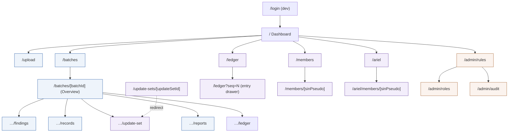
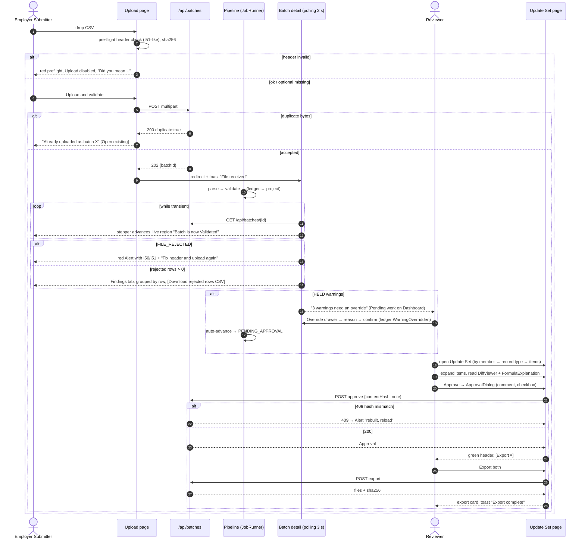
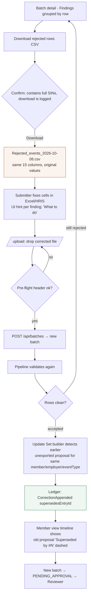
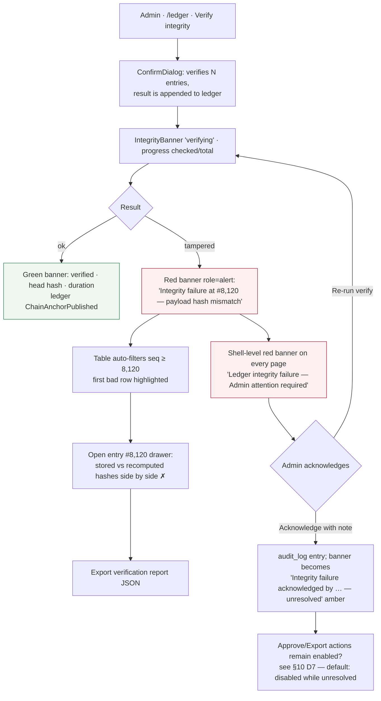

# HOOPP Events Ledger — UX Design Specification

**Status:** v1.0 design baseline (implementation-ready)
**Companion to:** `docs/architecture.md` (domain model §4, rules §7, Ariel derivation §8, ledger §9, batch state machine §10, API §11, pages §12, roles §13, phases §17)
**Stack assumed:** Next.js 15 App Router, React 19, TypeScript strict, Tailwind CSS 3.4 (already scaffolded). No component library installed yet — recommendation in §3.1.
**Audience:** Developer agent (builds from this), QA agent (derives E2E assertions), stakeholders (confirm §10 decisions)

---

## Table of contents

1. [Design principles](#1-design-principles)
2. [Information architecture & navigation](#2-information-architecture--navigation)
3. [Visual system & Tailwind tokens](#3-visual-system--tailwind-tokens)
4. [Core components](#4-core-components)
5. [Page specifications](#5-page-specifications)
6. [Key interaction flows](#6-key-interaction-flows)
7. [Microcopy guide](#7-microcopy-guide)
8. [Accessibility & responsiveness checklist](#8-accessibility--responsiveness-checklist)
9. [Developer handoff](#9-developer-handoff)
10. [Decisions needing stakeholder confirmation](#10-decisions-needing-stakeholder-confirmation)

---

## 1. Design principles

| # | Principle | What it means in this product | How we check it |
|---|---|---|---|
| P1 | **Trust is visible** | Every number a Reviewer approves shows where it came from (file column → derivation rule → formula with substituted values → Ariel before/after). Hashes, chain position and "verified at" are always one click away, never hidden. | Every `ArielUpdateItem` row has a provenance popover; every ledger-backed screen shows the `IntegrityBanner`. |
| P2 | **Lead with what to fix** | HR/payroll users are not pension analysts. Rejections are framed as *field → row → what to change → how to resubmit*, using the spec's Portal Message verbatim plus a UI-only "What to do" hint. Technical IDs (rule id, message id, level) are present but visually secondary. | Findings tab for Submitters groups by **row**, then severity. Rule/message IDs render in `text-ink-muted font-mono text-xs`. |
| P3 | **Dense but scannable for analysts** | Reviewers scan hundreds of items. Default body size 14 px, 40 px table rows, tabular numerals, sticky headers, zebra off / hover on, grouping by member then record type, keyboard navigation in every table. | All `DataTable`s pass the keyboard checklist (§8). Row height ≤ 40 px in `density="compact"`. |
| P4 | **One state language** | Batch status, row outcome, finding severity and ledger integrity each have exactly one colour + icon + label mapping (§3.3) used identically in badges, stepper, KPIs, charts and toasts. | Snapshot test on `StatusBadge`/`SeverityBadge` for every enum value. |
| P5 | **Never block without a way forward** | Every empty/error/held state names the next action and who can do it ("3 warnings need an override — Reviewers can do this from the Findings tab"). | Every state in §5 has copy + a CTA or a role note. |
| P6 | **PII-minimal by default** | SIN is masked (`***-***-563`) everywhere; reveal is explicit, permissioned, audit-logged and auto-hides. Names appear only where the legacy reports showed them. Nothing PII goes into URLs. | `MaskedSIN` is the only component that renders a SIN; grep rule in CI for 9-digit patterns in `src/app`. |
| P7 | **Accessible by construction** | WCAG 2.1 AA: 4.5:1 text contrast, 3:1 UI contrast, visible focus, no colour-only meaning (icon + text always), reduced-motion respected, live regions for async status. | §8 checklist is part of definition-of-done per page. |
| P8 | **Calm async** | Pipeline progress is shown with a stepper and polite live-region updates (polling every 3 s while a batch is in a transient state), never spinners that hide content. | `StepperTimeline` + `useBatchPolling` pattern (§9.4). |
| P9 | **Dark mode is optional, not an afterthought** | Tokens are CSS variables with a `.dark` scope so dark mode is a toggle, not a redesign. Ship light by default; dark is Phase 4 polish. | Token table in §3.2 has light + dark values. |

**Tone words:** precise, calm, respectful, plain. **Anti-patterns:** red walls of text, modal-on-modal, hidden destructive actions, colour-only status, unexplained numbers.

---

## 2. Information architecture & navigation

### 2.1 Shell layout

- **Left sidebar (240 px, collapsible to 64 px icon rail)**: product mark, primary navigation grouped by job, role chip at bottom (`EmployerSubmitter · Employer 0235`), theme toggle, "Dev login" link in non-production.
- **Top bar (56 px)**: breadcrumb (`Batches / 0192f3a4… / Findings`), global search (⌘K / Ctrl+K: batch id, employer, member pseudonym, ledger seq), environment pill (`LOCAL` / `DEV` — hidden in prod), user menu.
- **Content**: max width 1440 px, 24 px gutters, `PageHeader` + body. Tables stretch full width.
- **Right drawer (480 px)**: used for entry details (ledger), row details (records), override forms. Drawer, not modal, so tables stay visible behind.

### 2.2 Navigation groups & role visibility

| Group | Item | Route | EmployerSubmitter | Reviewer | Admin |
|---|---|---|---|---|---|
| — | Dashboard | `/` | ✔ (own employer scope) | ✔ | ✔ |
| Submit | Upload Events file | `/upload` | ✔ | ✖ (read nav hidden) | ✔ |
| Submit | Batches | `/batches` | ✔ (own employer) | ✔ | ✔ |
| Submit | Batch detail | `/batches/[batchId]/*` | ✔ own; tabs Overview, Findings, Records, Reports | ✔ all tabs | ✔ all tabs |
| Review | Pending approvals | `/batches?status=PENDING_APPROVAL` (saved view) | ✖ | ✔ | ✔ |
| Review | Update Set | `/batches/[batchId]/update-set` (alias `/update-sets/[updateSetId]` → redirect) | ✖ | ✔ | ✔ |
| Audit | Ledger explorer | `/ledger` | ✖ | ✔ (read) | ✔ (+ Verify) |
| Audit | Members | `/members`, `/members/[sinPseudo]` | ✖ | ✔ | ✔ |
| Audit | Mock Ariel | `/ariel`, `/ariel/members/[sinPseudo]` | ✖ | ✔ | ✔ (+ reset seed, dev only) |
| Admin | Rules & config | `/admin/rules` | ✖ | ✔ (read-only) | ✔ |
| Admin | Roles | `/admin/roles` (placeholder) | ✖ | ✖ | ✔ |
| Admin | Audit log | `/admin/audit` | ✖ | ✖ | ✔ |
| — | Dev login | `/login` (non-prod only) | ✔ | ✔ | ✔ |

Rules: hidden nav items are also **server-enforced** (architecture §13.1); the UI hides, the route handler denies. A Submitter deep-linking to `/ledger` gets the `403` page (§5.14), not a blank screen.

### 2.3 Sitemap



Legend: blue = Submitter-reachable, violet = Reviewer+, orange = Admin.

### 2.4 Breadcrumb & title conventions

- Batch ids are UUID v7; display as `0192f3a4…4e5f` (first 8 + last 4) with copy button; full id in `title` attribute and in the page `<h1>` visually-hidden span.
- Document `<title>`: `Findings · 0192f3a4 · Batches · HOOPP Events Ledger`.
- Page `<h1>` is always the `PageHeader` title; tabs are `<nav aria-label="Batch sections">` with `aria-current="page"`.

---
## 3. Visual system & Tailwind tokens

### 3.1 Component library recommendation: shadcn/ui (Radix primitives) — copied into `src/components/ui`

**Recommendation:** install **shadcn/ui** (CLI-generated components over **Radix UI primitives**, styled with Tailwind + `class-variance-authority`), plus **TanStack Table v8** (headless) for `DataTable`, **react-dropzone** for `FileDropzone`, **sonner** for toasts and **lucide-react** for icons.

Why this and not MUI/Chakra/Ant:

1. **Accessibility we don't have to build** — Radix `Dialog`, `Tabs`, `DropdownMenu`, `Popover`, `Tooltip`, `Toggle`, `Checkbox`, `Select` ship WCAG-compliant focus management, ARIA roles and keyboard handling. That is most of §8 for free.
2. **Owned code, not a dependency surface** — shadcn copies TSX into the repo; no runtime theme provider, no CSS-in-JS, works with React Server Components out of the box (most components are server-safe; only interactive ones are `'use client'`). Fits architecture's A06 posture (small dependency tree) and the "no component library yet" state.
3. **Tailwind-native theming** — tokens below are plain CSS variables consumed via `hsl(var(--…))`, exactly the shadcn convention, so dark mode is one `.dark` class.
4. **Headless table** — TanStack Table gives sorting/filtering/pagination/expansion/virtualisation without imposing markup, so the dense analyst table (P3) can stay `<table>` semantics for screen readers.

Install set (developer runs; **no other UI library**): `npx shadcn@latest init` then `add button badge card dialog drawer dropdown-menu input label popover select separator sheet skeleton switch table tabs textarea tooltip toggle alert alert-dialog command`. Add `@tanstack/react-table`, `react-dropzone`, `sonner`, `lucide-react`, `class-variance-authority`, `clsx`, `tailwind-merge`, `tailwindcss-animate`, `@tailwindcss/forms`.

### 3.2 Colour tokens

Palette is HSL in CSS variables (`src/app/globals.css`), referenced in Tailwind as `hsl(var(--token))`. All text/background pairs listed meet ≥ 4.5:1 in both modes; badge fills use `-soft` backgrounds with `-text` foregrounds (≥ 4.5:1) and `-solid` only for icons/indicators (≥ 3:1).

| Token | Role | Light | Dark |
|---|---|---|---|
| `--background` | page | `0 0% 100%` | `222 25% 9%` |
| `--surface` | cards, table, drawer | `210 20% 98%` | `222 22% 12%` |
| `--surface-raised` | popovers, sticky header | `0 0% 100%` | `222 20% 15%` |
| `--border` | hairlines | `214 20% 88%` | `220 14% 24%` |
| `--ink` | primary text | `222 32% 14%` | `210 20% 94%` |
| `--ink-muted` | secondary text | `220 10% 40%` | `218 12% 68%` |
| `--ink-faint` | placeholders, disabled | `220 9% 60%` | `218 10% 48%` |
| `--brand` | primary actions, links, focus | `214 72% 38%` | `214 80% 66%` |
| `--brand-hover` | | `214 72% 32%` | `214 80% 72%` |
| `--brand-soft` | selected row, info fill | `214 72% 95%` | `214 50% 18%` |
| `--focus` | focus ring (3 px) | `214 90% 55%` | `214 90% 70%` |
| **Severity** | | | |
| `--sev-file` / `-soft` / `-text` | FILE_ERROR | `0 70% 42%` / `0 80% 96%` / `0 70% 30%` | `0 70% 62%` / `0 40% 18%` / `0 80% 85%` |
| `--sev-cme` / `-soft` / `-text` | COMPLETE_MEMBER_ERROR | `8 76% 48%` / `8 85% 95%` / `8 76% 32%` | `8 80% 66%` / `8 40% 18%` / `8 85% 86%` |
| `--sev-warn` / `-soft` / `-text` | WARNING | `34 92% 44%` / `38 95% 93%` / `30 90% 28%` | `38 92% 62%` / `36 45% 17%` / `40 95% 85%` |
| `--sev-info` / `-soft` / `-text` | INFORMATION | `205 70% 42%` / `205 75% 94%` / `205 70% 28%` | `205 75% 66%` / `205 40% 18%` / `205 80% 86%` |
| **Outcome / approval** | | | |
| `--ok` / `-soft` / `-text` | accepted, approved, exported, verified | `152 60% 32%` / `150 60% 93%` / `152 60% 22%` | `152 55% 58%` / `152 35% 15%` / `150 60% 85%` |
| `--held` / `-soft` / `-text` | HELD row (needs override) | same as `--sev-warn` | same |
| `--rejected` / `-soft` / `-text` | rejected row, REJECTED batch | same as `--sev-cme` | same |
| **Ledger integrity** | | | |
| `--verified` | chain ok | alias of `--ok` | alias |
| `--tampered` / `-soft` / `-text` | chain broken | `350 85% 40%` / `350 90% 95%` / `350 85% 26%` | `350 85% 66%` / `350 45% 17%` / `350 90% 86%` |
| `--unverified` | never verified / stale > 24 h | alias of `--ink-muted` | alias |
| **Batch status (chips)** | | | |
| `--st-transient` | RECEIVED, PARSED, VALIDATED (auto-advancing), LEDGERED, PROJECTION_BUILT | `214 60% 45%` (brand-ish, animated dot) | `214 70% 68%` |
| `--st-attention` | VALIDATED **with HELD rows**, PENDING_APPROVAL | `34 92% 44%` (warn) | `38 92% 62%` |
| `--st-ok` | APPROVED, EXPORTED | `152 60% 32%` | `152 55% 58%` |
| `--st-bad` | REJECTED, FAILED, FILE_REJECTED | `8 76% 48%` | `8 80% 66%` |
| **Diff** | | | |
| `--diff-del` / `-soft` | before value | `8 76% 48%` / `8 85% 95%` | `8 80% 66%` / `8 40% 18%` |
| `--diff-add` / `-soft` | after value | `152 60% 32%` / `150 60% 93%` | `152 55% 58%` / `152 35% 15%` |
| `--diff-chg-soft` | changed cell background | `45 100% 92%` | `45 60% 16%` |

Status → colour map is **one** TypeScript object (`src/lib/ui/status-map.ts`) consumed by `StatusBadge`, `StepperTimeline`, KPI cards and chart legends, so no page redefines it.

### 3.3 Semantic mapping table (single source of truth)

| Enum | Value | Label (UI) | Colour token | Icon (lucide) |
|---|---|---|---|---|
| `FindingSeverity` | `FILE_ERROR` | File error | `sev-file` | `FileX2` |
| | `COMPLETE_MEMBER_ERROR` | Rejected (member error) | `sev-cme` | `CircleX` |
| | `WARNING` | Warning — override needed | `sev-warn` | `TriangleAlert` |
| | `INFORMATION` | Information | `sev-info` | `Info` |
| Row outcome | `ACCEPTED` | Accepted | `ok` | `CircleCheck` |
| | `HELD` | Held (needs override) | `held` | `CirclePause` |
| | `REJECTED` | Rejected | `rejected` | `CircleX` |
| `BatchStatus` | `RECEIVED` | Received | `st-transient` | `Inbox` |
| | `PARSED` | Parsed | `st-transient` | `FileText` |
| | `VALIDATED` | Validated | `st-transient` / `st-attention` when `held > 0` | `ShieldCheck` / `ShieldAlert` |
| | `LEDGERED` | Written to ledger | `st-transient` | `Link2` |
| | `PROJECTION_BUILT` | Update Set built | `st-transient` | `Layers` |
| | `PENDING_APPROVAL` | Pending approval | `st-attention` | `Hourglass` |
| | `APPROVED` | Approved | `st-ok` | `BadgeCheck` |
| | `REJECTED` | Rejected by reviewer | `st-bad` | `Ban` |
| | `EXPORTED` | Exported | `st-ok` | `PackageCheck` |
| | `FAILED` | Failed — retry available | `st-bad` | `CircleAlert` |
| | `FILE_REJECTED` | File rejected | `st-bad` | `FileX2` |
| Integrity | `ok` | Verified | `verified` | `ShieldCheck` |
| | `tampered` | Integrity failure | `tampered` | `ShieldX` |
| | `unverified` | Not verified | `unverified` | `ShieldQuestion` |
| `ArielOperation` | `CREATE` | Create | `diff-add` | `Plus` |
| | `UPDATE` | Update | `brand` | `Pencil` |
| | `UPSERT_ADD` | Add to existing | `brand` | `PlusCircle` |
| | `CLOSE` | Close | `sev-warn` | `SquareX` |
| | `DELETE` | Delete | `diff-del` | `Trash2` |
| | `SET_FLAG` | Set flag | `sev-info` | `Flag` |

### 3.4 Typography

Font: **Inter** (variable, `next/font/google`, `font-display: swap`) for UI; **JetBrains Mono** for hashes, ids, raw file values, JSON. Enable `font-feature-settings: "tnum" 1, "cv11" 1` on tables (`.tabular-nums`).

| Token | Size / line | Weight | Use |
|---|---|---|---|
| `text-display` | 28 / 34 | 600 | Dashboard KPI numbers |
| `text-h1` | 22 / 28 | 600 | PageHeader title |
| `text-h2` | 18 / 26 | 600 | Card / section titles |
| `text-h3` | 15 / 22 | 600 | Group headers inside tables (member accordion) |
| `text-body` | 14 / 20 | 400 | Default |
| `text-body-strong` | 14 / 20 | 500 | Table header cells, labels |
| `text-small` | 13 / 18 | 400 | Table cells in compact density, helper text |
| `text-caption` | 12 / 16 | 400/500 | Badges, rule ids, timestamps |
| `text-mono` | 13 / 18 | 400 | Hashes, ids, raw values (JetBrains Mono) |

Minimum rendered size is 12 px; 12 px is only used uppercase-free with ≥ 4.5:1 contrast.

### 3.5 Spacing, radius, elevation, motion

- **Spacing** uses the default Tailwind 4 px scale. Page gutters `px-6` (24), section gap `gap-6`, card padding `p-5`, table cell padding `px-3 py-2` (compact) / `px-4 py-3` (comfortable).
- **Radius:** `--radius: 8px`; `rounded-sm` 4 (badges, inputs), `rounded-md` 8 (cards, buttons), `rounded-lg` 12 (drawers, dialogs), `rounded-full` (status dots, avatars).
- **Elevation:** flat UI; use borders first. `shadow-card` (`0 1px 2px 0 hsl(222 32% 14% / .06)`) for cards, `shadow-pop` (`0 8px 24px -8px hsl(222 32% 14% / .25)`) for popovers/drawers. Dark mode: increase surface lightness instead of shadow.
- **Motion:** 150 ms ease-out for hover/focus, 200 ms for drawer/dialog, stepper pulse 1.6 s. All wrapped in `motion-safe:`; `prefers-reduced-motion` disables pulse and slide.
- **Focus:** `outline-none ring-[3px] ring-focus ring-offset-2 ring-offset-background` on every interactive element; never remove without replacement.

### 3.6 Tailwind config — `theme.extend` (drop-in)

```ts
// tailwind.config.ts
import type { Config } from "tailwindcss";
import forms from "@tailwindcss/forms";
import animate from "tailwindcss-animate";

const hsl = (v: string) => `hsl(var(--${v}) / <alpha-value>)`;

const config: Config = {
  darkMode: ["class"],
  content: ["./src/**/*.{ts,tsx,mdx}"],
  theme: {
    container: { center: true, padding: "1.5rem", screens: { "2xl": "1440px" } },
    extend: {
      colors: {
        background: hsl("background"),
        surface: { DEFAULT: hsl("surface"), raised: hsl("surface-raised") },
        border: hsl("border"),
        ink: { DEFAULT: hsl("ink"), muted: hsl("ink-muted"), faint: hsl("ink-faint") },
        brand: { DEFAULT: hsl("brand"), hover: hsl("brand-hover"), soft: hsl("brand-soft") },
        focus: hsl("focus"),
        sev: {
          file: { DEFAULT: hsl("sev-file"), soft: hsl("sev-file-soft"), text: hsl("sev-file-text") },
          cme: { DEFAULT: hsl("sev-cme"), soft: hsl("sev-cme-soft"), text: hsl("sev-cme-text") },
          warn: { DEFAULT: hsl("sev-warn"), soft: hsl("sev-warn-soft"), text: hsl("sev-warn-text") },
          info: { DEFAULT: hsl("sev-info"), soft: hsl("sev-info-soft"), text: hsl("sev-info-text") },
        },
        ok: { DEFAULT: hsl("ok"), soft: hsl("ok-soft"), text: hsl("ok-text") },
        held: { DEFAULT: hsl("sev-warn"), soft: hsl("sev-warn-soft"), text: hsl("sev-warn-text") },
        rejected: { DEFAULT: hsl("sev-cme"), soft: hsl("sev-cme-soft"), text: hsl("sev-cme-text") },
        verified: { DEFAULT: hsl("ok"), soft: hsl("ok-soft"), text: hsl("ok-text") },
        tampered: { DEFAULT: hsl("tampered"), soft: hsl("tampered-soft"), text: hsl("tampered-text") },
        unverified: hsl("ink-muted"),
        st: {
          transient: hsl("st-transient"),
          attention: hsl("st-attention"),
          ok: hsl("st-ok"),
          bad: hsl("st-bad"),
        },
        diff: {
          del: { DEFAULT: hsl("diff-del"), soft: hsl("diff-del-soft") },
          add: { DEFAULT: hsl("diff-add"), soft: hsl("diff-add-soft") },
          chg: { soft: hsl("diff-chg-soft") },
        },
      },
      fontFamily: {
        sans: ["var(--font-inter)", "ui-sans-serif", "system-ui", "sans-serif"],
        mono: ["var(--font-jetbrains)", "ui-monospace", "SFMono-Regular", "monospace"],
      },
      fontSize: {
        display: ["1.75rem", { lineHeight: "2.125rem", fontWeight: "600" }],
        h1: ["1.375rem", { lineHeight: "1.75rem", fontWeight: "600" }],
        h2: ["1.125rem", { lineHeight: "1.625rem", fontWeight: "600" }],
        h3: ["0.9375rem", { lineHeight: "1.375rem", fontWeight: "600" }],
        body: ["0.875rem", { lineHeight: "1.25rem" }],
        small: ["0.8125rem", { lineHeight: "1.125rem" }],
        caption: ["0.75rem", { lineHeight: "1rem" }],
      },
      borderRadius: {
        sm: "calc(var(--radius) - 4px)",
        md: "var(--radius)",
        lg: "calc(var(--radius) + 4px)",
      },
      boxShadow: {
        card: "0 1px 2px 0 hsl(222 32% 14% / 0.06)",
        pop: "0 8px 24px -8px hsl(222 32% 14% / 0.25)",
      },
      spacing: { sidebar: "15rem", "sidebar-rail": "4rem", topbar: "3.5rem", drawer: "30rem" },
      keyframes: {
        pulseDot: { "0%,100%": { opacity: "1" }, "50%": { opacity: "0.35" } },
      },
      animation: { "pulse-dot": "pulseDot 1.6s ease-in-out infinite" },
    },
  },
  plugins: [forms, animate],
};
export default config;
```

`globals.css` must define every `--token` from §3.2 under `:root` and `.dark`, set `--radius: 8px`, and add `.tabular-nums { font-variant-numeric: tabular-nums; }`.

---
## 4. Core components

All live under `src/components/`. `ui/` = shadcn primitives (generated). `app/` = product components below. Props are TypeScript; types referenced (`Batch`, `ValidationFinding`, …) come from `src/types/*` (architecture §4). Every component: `className` passthrough, `data-testid` where listed, forwardRef on focusable root.

### 4.1 `AppShell` — `src/components/app/app-shell.tsx` (server) + `sidebar-nav.tsx` (client)

| Prop | Type | Notes |
|---|---|---|
| `user` | `{ id; displayName; role: Role; employerId?: string }` | from `AuthProvider` |
| `nav` | `NavGroup[]` (derived from role on the server) | never pass hidden items to the client |
| `env` | `'local' \| 'dev' \| 'prod'` | pill hidden in prod |
| `children` | | |

States: sidebar expanded (default ≥ 1280) / rail (1024–1279, or user toggle persisted in `localStorage`) / off-canvas sheet (< 1024). Keyboard: `[` toggles sidebar; Ctrl/⌘+K opens command palette (`CommandPalette`, client). Skip link `#main` is the first focusable element. `data-testid="app-shell"`.

### 4.2 `PageHeader`

| Prop | Type |
|---|---|
| `title` | `ReactNode` (string or `<span>` with `MaskedSIN`) |
| `description?` | `ReactNode` |
| `breadcrumbs?` | `{ label; href? }[]` |
| `meta?` | `ReactNode[]` — small inline facts (`StatusBadge`, `Received 2026-10-08 14:03`, `Employer 0235`) rendered as a `<dl>` |
| `actions?` | `ReactNode` — primary button first (right aligned), overflow in `DropdownMenu` |
| `tabs?` | `{ label; href; count?: number; hidden?: boolean }[]` |

Renders `<h1>`; tabs as `<nav aria-label>` + `<a aria-current>`. Sticky under top bar on scroll (`top-topbar`), shadow appears when stuck.

### 4.3 `StatusBadge` (batch) & `SeverityBadge` & `OutcomeBadge` & `OperationBadge`

Single generic `Badge` with `variant` resolved via `status-map.ts`.

```ts
type StatusBadgeProps = { status: BatchStatus; heldCount?: number; size?: 'sm' | 'md'; showIcon?: boolean; pulse?: boolean };
type SeverityBadgeProps = { severity: FindingSeverity; size?: 'sm' | 'md'; count?: number }; // count renders "Warning · 3"
type OutcomeBadgeProps  = { outcome: 'ACCEPTED' | 'HELD' | 'REJECTED' };
type OperationBadgeProps = { operation: ArielOperation };
```

- Icon + text always (P7). `pulse` auto-true for transient statuses (`animate-pulse-dot` on the dot only).
- `VALIDATED` with `heldCount > 0` renders "Validated · 3 held" in `st-attention`.
- Accessible name = label; `title` carries the enum value for support staff.

### 4.4 `DataTable` — `src/components/app/data-table/*` (client; TanStack Table)

```ts
interface DataTableProps<T> {
  columns: ColumnDef<T>[];           // TanStack; use `meta: { align, mono, sticky, width }`
  data: T[];
  rowId: (row: T) => string;
  // server-driven paging (cursor) OR client paging
  pagination?: { mode: 'cursor'; nextCursor?: string; onNext(): void; onPrev(): void; pageSize: number }
             | { mode: 'client'; pageSize?: number };
  sorting?: { state: SortingState; onChange(s: SortingState): void } | 'client';
  filters?: ReactNode;               // toolbar slot (facet selects, search) — see FilterBar
  search?: { placeholder; value; onChange; debounceMs?: 300 };
  density?: 'compact' | 'comfortable';          // default compact for analyst pages
  stickyHeader?: boolean;                        // default true
  expandable?: { render(row: T): ReactNode; isExpandable?(row: T): boolean };
  selectable?: { selected: Set<string>; onChange(next: Set<string>): void; max?: number };
  groupBy?: { getKey(row: T): string; renderHeader(key: string, rows: T[]): ReactNode; defaultCollapsed?: boolean };
  state: { status: 'idle' | 'loading' | 'error' | 'empty'; error?: { message; retry?(): void } };
  emptyState: { title; description?; action?: ReactNode; illustration?: 'none' | 'inbox' | 'search' };
  onRowClick?(row: T): void;        // also Enter/Space on focused row
  rowClassName?(row: T): string;    // e.g. HELD rows get `bg-held-soft/40`
  caption: string;                   // visually-hidden <caption> for AT
  toolbarEnd?: ReactNode;            // "Download CSV" etc.
  'data-testid'?: string;
}
```

Behaviour & states:

- **Loading:** header rendered; 8 skeleton rows (`SkeletonLoader variant="table-rows"`); toolbar disabled; `aria-busy="true"` on table region.
- **Empty:** `EmptyState` inside the table body spanning all columns.
- **Error:** inline `Alert variant="error"` in body with Retry; keeps previous data visible greyed if any (`stale`).
- **Sorting:** header button with `aria-sort`; shift-click multi-sort off by default.
- **Sticky:** `thead` `sticky top-0 z-10 bg-surface-raised` with bottom hairline; first column optionally sticky left on wide tables.
- **Expansion:** chevron button with `aria-expanded`; expanded panel is a full-width `<tr>` with `role="region"` and `aria-labelledby`.
- **Keyboard:** roving tabindex on rows (`↑/↓`), `Enter` opens/triggers `onRowClick`, `→/←` expand/collapse, `Home/End`, `PageUp/PageDown` paginate. Column header reachable via Tab.
- **Numbers** right-aligned, `tabular-nums`, money `#,##0.00`, weeks `0.00`.
- **Pagination footer:** "Showing 1–50 of ~1,240" (approximate for cursor mode: "Showing 50 · more available").

### 4.5 `FilterBar`

Horizontal toolbar: `FacetSelect` (multi-select with counts, e.g. Severity ▾ `Rejected 12 · Warning 3`), `DateRangePicker`, `SearchInput`, "Clear filters" link, active filters as removable chips. Filter state lives in the URL (`?severity=WARNING,COMPLETE_MEMBER_ERROR&ruleId=B40`) so links are shareable and `loading.tsx` works with `searchParams`.

### 4.6 `FileDropzone` (client; react-dropzone)

```ts
interface FileDropzoneProps {
  accept: { 'text/csv': ['.csv'] };     // fixed
  maxBytes: number;                       // from server (MAX_UPLOAD_BYTES, default 20 MB)
  maxRows?: number;                       // 50,000 – shown in helper text
  onFile(file: File): void;               // single file only
  preflight?: PreflightResult | null;     // header check result (see Upload page)
  progress?: { phase: 'hashing' | 'uploading' | 'queued'; percent?: number } | null;
  disabled?: boolean;
  error?: string | null;
}
```

States: `idle` (dashed border, icon, "Drop your Events CSV here or **browse**", helper "CSV only · up to 20 MB · up to 50,000 rows"), `drag-over` (brand border + soft fill), `file-selected` (file card: name, size, sha256 computing → done, "Replace" / "Remove"), `preflight-ok` (green check "Header matches the Events layout — 15 columns"), `preflight-warn` (optional columns missing — allowed), `preflight-error` (unknown/duplicate header → block submit, list offending headers), `uploading` (progress bar, `aria-valuenow`), `rejected` (wrong type/size — message leads with the fix). Keyboard: root is a `button`-role element with `Enter/Space` → file picker. Live region announces state changes.

### 4.7 `StepperTimeline` (batch pipeline)

```ts
interface StepperTimelineProps {
  status: BatchStatus;
  heldCount: number;
  history: { toStatus: BatchStatus; at: string; actor: string; note?: string }[];
  orientation?: 'horizontal' | 'vertical';   // horizontal in Overview, vertical in the drawer
  failureReason?: string;
}
```

Steps (fixed order): Received → Parsed → Validated → Ledgered → Update Set built → Pending approval → Approved / Rejected → Exported. Each step: `done` (check, ok colour, timestamp), `current` (pulsing dot, transient colour; if `VALIDATED && heldCount>0` shows attention colour + "3 held rows need an override"), `upcoming` (faint), `terminal-bad` (`FILE_REJECTED` replaces Parsed with a red node "File rejected"; `FAILED` attaches a red node to the last reached step with `failureReason` and Retry for Admin; `REJECTED` branch node after Pending approval with reason and "Reopen" for Admin). Hover/focus on a node shows actor + time + note in a tooltip; `<ol>` semantics with `aria-current="step"`.

### 4.8 `FindingCard` & `FindingsTable`

`FindingsTable` is a `DataTable<ValidationFinding>` preset. Columns (compact): Severity · Row (`#12`) · Member (`MaskedSIN` + initials) · Field (`Weeks_CurrentYear`, with year scope chip `CY`/`PY`) · Portal message (wrapped, 2-line clamp, expand) · Rule (`B184c` mono, hover → label) · Msg ID · Override (status/button). Group modes: by **severity** (default for Reviewer), by **row** (default for Submitter), by **rule**.

`FindingCard` (used in row expansion and Submitter view) layout:

```
┌─────────────────────────────────────────────────────────────────────────┐
│ ● Rejected (member error)                             Rule B184c · 7854 │
│ Row 12 · ***-***-563 A.A. · Field Weeks_CurrentYear · Current year       │
│                                                                           │
│ In-year termination: Total Weeks reported for the reporting year plus    │
│ weeks previously reported exceed the maximum possible weeks.              │
│                                                                           │
│ What to do: Reduce Weeks_CurrentYear so the total is at most 38.86.      │
│ File value: 45.00   HOOPP calculated maximum: 38.86   Already in Ariel: 5.00 │
│                                                                           │
│ ▸ Technical detail (DataImport message, parameters, calculated values)   │
└─────────────────────────────────────────────────────────────────────────┘
```

Props: `finding: ValidationFinding`, `record?: RecordSummary`, `showPrivate: boolean`, `onOverride?(finding)`, `compact?: boolean`. "What to do" comes from `src/lib/ui/finding-hints.ts` (rule-id → template) and falls back to the Portal message when no hint exists. PRIVATE findings render with a `Lock` icon and "HOOPP-internal" tag and are only passed to the component when the role allows (server filters).

### 4.9 `OverrideDrawer` (client)

Opened from a WARNING finding. Shows the `FindingCard`, radio list of `overrideReasons` (verbatim), `note` textarea (required when reason starts with "Other"), "Who will see this" note (ledger + Summary of Validations), Confirm. Posts `POST /api/findings/{id}/override`. Success toast: "Override recorded. Row 12 is now accepted." Error 422 (reason not allowed) shown inline.

### 4.10 `DiffViewer`

```ts
interface DiffViewerProps {
  item: ArielUpdateItem;                 // before / fields / operation / targetKey
  mode?: 'table' | 'inline';            // table: Field | Before | After ; inline: before→after chips
  highlightOnlyChanged?: boolean;       // default true; toggle "Show unchanged fields"
}
```

Rows per field in `fields`. `before === undefined/null` for CREATE → Before column shows "— (new)". For `UPSERT_ADD` the After cell shows `1,200.00 + 523.64 = 1,723.64` with the file term highlighted and a tooltip "Added to existing Ariel transaction with the same key". `DELETE` shows all before values struck-through. Dates ISO; money 2 dp; booleans "Yes/No"; nulls "—". Changed cells use `diff-chg-soft`; before text `diff-del`, after text `diff-add`. Copy-as-JSON button for the whole item. Semantics: `<table>` with `<th scope>`.

### 4.11 `FormulaExplanation`

```ts
interface FormulaExplanationProps {
  derivationRule: string;                              // "D-CONTRIB-RPPHGH-CLC-CY"
  explanation: string;                                 // from item (already substituted)
  terms?: { label: string; value: string; source: 'file' | 'ariel' | 'rate' | 'constant' }[];  // optional structured terms
  result: { label: string; value: string };
}
```

Renders the rule id as a chip (link to `/admin/rules#D-CONTRIB-RPPHGH-CLC-CY` anchor), the symbolic formula (from a static map keyed by derivation rule, e.g. `RPPHGH_CLC = −MAX(0, Pool − (1000 + 0.7 × PA)) − PriorCLC`), then the substituted line from `explanation`, then a term legend coloured by source (file = brand, Ariel = ink-muted, rate table = sev-info, constant = ink-faint). Monospace; wraps at operators; `aria-label` reads the plain explanation. Used in Update Set item expansion and Member view.

### 4.12 `LedgerEntryCard` & `HashChip`

`HashChip`: `{ hash: string; label?: string; truncate?: 8 | 12; verified?: boolean | null; href?: string }` → `9f86d081…0a08` mono, copy button (`aria-label="Copy full hash"`), optional link (prev hash → `/ledger?seq=N-1`), optional check/x icon when a recomputed comparison is known.

`LedgerEntryCard`: `{ entry: LedgerEntry; recomputed?: { payloadHash; entryHash; matches: boolean }; variant: 'row' | 'full' }`.

```
┌ #10452  ArielUpdateProposed  batch 0192f3a4…  member:…7c1e (stream #4)  2026-10-08T14:03:19.412Z  system:pipeline ┐
│ entryHash  9f86d081…0a08 ⧉   prevGlobal  3b2c…91ee ⧉ ↗   prevStream  77aa…c0d1 ⧉ ↗   payloadHash  51cd…e3a9 ⧉  ✓ recomputed matches │
│ ▸ Payload (JSON)                                                                                              │
└───────────────────────────────────────────────────────────────────────────────────────────────────────────────┘
```

Payload JSON in a collapsible `<pre>` with syntax tint, "Copy", "Download .json"; search within payload. Never shows a raw SIN (payload is guaranteed pseudonymised).

### 4.13 `IntegrityBanner`

```ts
interface IntegrityBannerProps {
  result: { ok: boolean; checked: number; headSeq: number; headHash: string; verifiedAt: string; firstBadSeq?: number; reason?: string; durationMs: number } | null;
  stale?: boolean;                 // verifiedAt older than 24 h
  canVerify: boolean;              // Admin
  onVerify?(): void;
  verifying?: { checked: number; total: number } | null;
}
```

Variants: **verified** (green, `ShieldCheck`, "Chain verified · 10,452 entries · head 9f86…0a08 · 2026-10-08 02:00 UTC · 1.2 s"), **stale** (neutral, "Last verified 3 days ago" + Verify now), **unverified** (neutral), **verifying** (brand, progress bar + "Checking 4,200 / 10,452"), **tampered** (red, `role="alert"`, "Integrity failure at entry #8,120 — payload hash mismatch. Entries after #8,120 cannot be trusted." + "Open entry #8,120" + "Export verification report"). Tampered state persists across pages (shell-level) until an Admin acknowledges in the UI (acknowledgement is audit-logged, not a fix).

### 4.14 `ApprovalDialog` (client; shadcn `AlertDialog`)

```ts
interface ApprovalDialogProps {
  decision: 'APPROVE' | 'REJECT';
  updateSet: { updateSetId; contentHash; memberCount; itemCount; byRecordType: Record<ArielRecordType, number>; byOperation: Record<ArielOperation, number> };
  batch: { batchId; employerId; filename; counts };
  heldCount: number;                     // > 0 disables approve with explanation
  onConfirm(input: { comment: string }): Promise<void>;
}
```

Approve: title "Approve Update Set for export?", summary table (members, items by record type, operations), content hash chip, comment textarea (**required**, min 10 chars — see §10 D3), checkbox "I have reviewed the derived changes and warnings in this Update Set" (required), primary button "Approve 142 changes". Reject: title "Reject this Update Set?", reason textarea required, info "The batch returns to Validated; an Admin can reopen it after fixes." Both show 409 handling: "This Update Set changed while you were reviewing (content hash mismatch). Reload to see the latest version." Focus trapped; `Esc` cancels; confirm disabled until valid.

### 4.15 `MaskedSIN`

```ts
interface MaskedSINProps {
  masked: string;                        // "***-***-563" (always available)
  sinPseudo: string;                     // for links
  canReveal?: boolean;                   // Reviewer/Admin AND feature flag
  reveal?: () => Promise<string>;        // POST to a reveal endpoint (audit-logged) — see §10 D5
  initials?: string;                     // "A.A."
  linkToMember?: boolean;
}
```

Renders mono `***-***-563` with optional initials; eye button (if `canReveal`) → shows full SIN for 10 s then re-masks; toast "SIN revealed — this action was logged". Copy is disabled while revealed (deliberate). `aria-label="SIN ending in 563"`.

### 4.16 `StatCard` (KPI)

`{ label; value: string | number; format?: 'int' | 'pct' | 'money' | 'duration'; delta?: { value: number; direction: 'up' | 'down'; good: boolean; label: string }; status?: 'ok' | 'attention' | 'bad' | 'neutral'; href?; icon?; footer?: ReactNode; loading?: boolean }`. Value in `text-display tabular-nums`; the whole card is a link when `href`.

### 4.17 `Toast` (sonner) & `Alert`

Toast: bottom-right, max 3, 6 s (errors persist until dismissed), icon + title + optional description + optional action; `aria-live="polite"` (errors `assertive`). `Alert` (inline): `variant: 'info' | 'success' | 'warning' | 'error'`, optional title, actions slot; `role="status"` or `"alert"` for error.

### 4.18 `ConfirmDialog`

Generic for destructive/irreversible actions (reset seed, force reprocess, reopen batch, acknowledge tamper): `title`, `body`, `confirmLabel`, `tone: 'default' | 'danger'`, optional `typeToConfirm: string` (e.g. type `RESET`), `requireReason?: boolean`.

### 4.19 `SkeletonLoader`

Variants: `kpi-grid`, `table-rows (n)`, `card`, `stepper`, `drawer`, `diff`. Uses `animate-pulse` wrapped in `motion-safe:`. Matches final layout dimensions to avoid layout shift.

### 4.20 `EmptyState`

`{ title; description?; action?; illustration?: 'inbox' | 'search' | 'shield' | 'none'; compact?: boolean }` — icon from lucide at 40 px in `ink-faint`, centred, max-width 420 px.

### 4.21 `CommandPalette` (client)

Ctrl/⌘+K. Sections: Navigate (pages for role), Batches (search by id prefix / filename), Members (by pseudonym or "SIN lookup…" which opens a small form that POSTs to `/api/members/lookup`), Ledger ("Go to seq #…"). Recent items persisted locally.

### 4.22 `JsonViewer`

Collapsible tree for ledger payloads, `targetKey`, `params`, `calculated`. Copy path/value; search; depth control. Values that look like money strings are shown as-is (never reformatted — provenance).

---


## 5. Page specifications

Conventions used below: **Primary** = one filled brand button; **Secondary** = outline/ghost. "States" lists empty / loading / error / success unless trivial. Role access repeats §2.2. Wireframes are 1280 px layouts; sidebar omitted for brevity.

### 5.1 Dashboard — `/`

**Users:** all roles (Submitter scoped to own employer; Reviewer/Admin global). **Job:** "What needs my attention right now, and is the system healthy?"

```
+ PageHeader: Dashboard                                 [Upload Events file] (Submitter/Admin) +
| Employer 0235 - St. Michael's (Submitter)  |  All employers v (Reviewer/Admin)                 |
+-----------------------------------------------------------------------------------------------+
| + Batches today + + Pending approvals + + Rejection rate (30 d) + + Ledger -----------------+ |
| | 4             | | 2  -> review      | | 6.8 %  v 1.2 pt good  | | 10,452 entries         | |
| | 1 in progress | | oldest 2 h ago    | | 83 of 1,220 rows       | | * Verified 02:00 UTC   | |
| +---------------+ +-------------------+ +------------------------+ +------------------------+ |
+----------------------------------------------+------------------------------------------------+
| Needs attention (table, max 10)              | Recent batches (table, max 10)                 |
| * 3 held rows   0192f3a4.. 0235 events_1008  | 0192f3a4.. 0235 events_1008.csv  Pending appr. |
| * Pending appr. 0192f2b1.. 0359 term_oct.csv | 0192f2b1.. 0359 term_oct.csv     Validated-3 held |
| * Failed        0192f1c0.. 0135 ret_q3.csv   | ...                                             |
|                                 [View all ->]|                                   [View all ->]|
+----------------------------------------------+------------------------------------------------+
| Findings by rule - last 30 days (horizontal bar list, top 8; click -> batches filtered) (Rev/Adm) |
+-----------------------------------------------------------------------------------------------+
```

- **KPIs:** `StatCard x 4`: Batches today (sub: in-progress count); Pending approvals (Reviewer/Admin; Submitter sees "Awaiting HOOPP review" instead); Rejection rate (rows rejected / rows, 30 d, delta vs previous 30 d); Ledger (entry count + `IntegrityBanner` micro-variant: Verified / Stale / Tampered; Admin: click → `/ledger`).
- **Needs attention** rows: HELD batches, PENDING_APPROVAL, FAILED, FILE_REJECTED in the last 7 days (Submitter sees own). Row click → batch detail at the relevant tab.
- **Data:** server component; `GET /api/batches?limit=10` plus KPI aggregates computed server-side in `lib/queries/dashboard.ts`.
- **States:** loading `SkeletonLoader kpi-grid` + table rows; empty (no batches) → `EmptyState` "No Events files yet" + Upload CTA (Submitter) / "No batches yet — employers haven't uploaded" (Reviewer); error → page-level `Alert` with retry; tampered ledger → global `IntegrityBanner` red at top of content, above KPIs.
- **Polling:** none on dashboard; "Refreshed 14:03 · Refresh" ghost link.

### 5.2 Upload Events file — `/upload`

**Users:** EmployerSubmitter (employer fixed), Admin (employer selector, execution-date override, force reprocess). **Job:** get a CSV in, know immediately if the header is wrong, and land on the batch.

```
+ PageHeader: Upload Events file                                                            +
| Terminations (TERFIN), retirements (RETFIN) and pre-retirement deaths (DECFIN).           |
+---------------------------------------+---------------------------------------------------+
| 1  File                               | Before you upload                                 |
| +-----------------------------------+ | - CSV with the 15-column Events header            |
| |   ^  Drop your Events CSV here    | | - Dates as MMDDYYYY (e.g. 09302026)               |
| |      or browse                    | | - One row per member                              |
| |  CSV only - up to 20 MB - 50,000  | | - SIN without hyphens                             |
| +-----------------------------------+ | [Download header template .csv]                   |
| + events_2026-10-08.csv  18.2 KB  x + | [Open file layout reference]                      |
| | sha256 9f86d081..0a08 [copy]      | |                                                   |
| | OK Header matches Events layout   | | What happens next                                 |
| |    15 columns - 121 data rows     | | Received -> Parsed -> Validated -> Update Set ->  |
| +-----------------------------------+ | HOOPP review -> Export. Results usually in under   |
|                                       | a minute for typical files.                       |
| 2  Details                            |                                                   |
| Employer        0235 - St. Michael's  |                                                   |
| Execution date  2026-10-08 (today) (i)|  (Admin: editable date, employer v, [ ] Force      |
|                                       |   reprocess if identical file exists)             |
|                            [Cancel] [Upload and validate]  <- primary                     |
+---------------------------------------+---------------------------------------------------+
```

**Pre-flight header check (client-side, before upload):** read the first 64 KB with `FileReader`, detect BOM/encoding hint, split the first line on commas, trim, compare to `EVENTS_CSV_COLUMNS` (case-sensitive, order-insensitive, per I51). Outcomes:

- All 15 present → green "Header matches the Events layout".
- Only optional columns missing (e.g. `HighContributions_PreviousYear`) → amber "Header is missing 2 optional columns — allowed; those fields will be treated as blank". Upload allowed.
- Unknown or duplicate header → red "This header will be rejected (I51). Unknown columns: `Weeks_CurrYear`. Did you mean `Weeks_CurrentYear`?" Upload disabled until a new file is chosen (Admin may "Upload anyway" to produce a FILE_REJECTED batch for the record — secondary ghost action).
- Extra cells on data rows (I50) are **not** pre-checked (needs a full parse) — covered post-upload.

The pre-flight is advisory; the server's L0 rules are authoritative and the (i) tooltip says so.

**Submit:** `POST /api/batches` multipart. Progress phases: Hashing (client SHA-256 via WebCrypto, shown so the user can match the manifest) → Uploading (percent) → Queued. On `202` → `router.push('/batches/[id]')` with toast "File received — validating now". On `200 duplicate:true` → interstitial card: "This exact file was already uploaded on 2026-10-01 as batch 0192e1…  [Open existing batch]  (Admin: [Upload as new batch — force])". On `400/413/415` → inline `Alert` leading with the fix ("The file is 24.1 MB; the limit is 20 MB. Split it into two files and upload each.").

**States:** idle; file selected; pre-flight ok/warn/error; uploading (dropzone disabled, Cancel aborts fetch); success (redirect); error. Keyboard: full tab order; dropzone activatable. Role: Submitter has no employer/date controls (shown read-only).

### 5.3 Batches list — `/batches`

**Users:** all (Submitter scoped). **Job:** find a batch; see progress at a glance.

```
+ PageHeader: Batches                                                   [Upload Events file] +
+--------------------------------------------------------------------------------------------+
| [Search batch id / filename...]  Status v(All)  Employer v(All)  Received v(Last 30 days)   |
| Saved views: All - Needs attention - Pending approval - Completed     Clear filters  (auto) |
+--------------------------------------------------------------------------------------------+
| Received v        Batch        Employer  File              Status              Rows Acc Rej Warn |
| 2026-10-08 14:03  0192f3a4..   0235      events_1008.csv   * Pending approval   121 118   3    2 |
| 2026-10-08 11:20  0192f2b1..   0359      term_oct.csv      * Validated - 3 held  48  45   0    3 |
| 2026-10-07 16:45  0192f1c0..   0135      ret_q3.csv        * Failed - retry      -    -   -    - |
| 2026-10-07 09:02  0192f0aa..   0235      events_1007.csv   * Exported           210 204   6    4 |
| 2026-10-06 ...    ...          ...       ...               * File rejected       -    -   -    - |
+--------------------------------------------------------------------------------------------+
| Showing 50 - more available                                              [< Prev] [Next >] |
+--------------------------------------------------------------------------------------------+
```

- Columns: Received (sortable, default desc), Batch (short id + copy), Employer (code + name tooltip; hidden for Submitter), File, Status (`StatusBadge`), Rows / Accepted / Rejected / Warnings (right-aligned; Rejected > 0 tinted `rejected-text`, Warnings > 0 `held-text`), Actions (⋯: Open, Download rejected rows, Open Update Set, Retry (Admin, FAILED)).
- Row click → `/batches/[id]`. Filters in URL. Search matches batch id prefix or filename substring.
- **Auto-refresh:** when any visible batch is in a transient status, poll `GET /api/batches` every 3 s (client island around the table), indicated by "(auto)" with a tooltip; paused when the tab is hidden.
- **States:** loading skeleton; empty with filters → "No batches match these filters" + Clear; empty without → "No Events files yet" + Upload CTA (Submitter) / informational (Reviewer); error → inline retry.

### 5.4 Batch detail — `/batches/[batchId]` (layout + tabs)

Shared `layout.tsx` renders `PageHeader` with tabs; children per tab. Header meta: `StatusBadge`, Employer, File name + sha256 chip, Received, Execution date, Uploaded by, Rules config hash (Reviewer/Admin). Actions (role-dependent, in priority order): **Review Update Set** (Reviewer/Admin when ≥ PROJECTION_BUILT) · **Download rejected rows (CSV)** (when rejected > 0) · **Approve / Reject** (PENDING_APPROVAL; Reviewer/Admin) · **Export** (APPROVED) · ⋯ Retry (FAILED, Admin) · Reopen (REJECTED, Admin) · Force reprocess (Admin).

Tabs & visibility: Overview · Findings (`count`) · Records (`rows`) · Update Set (Reviewer/Admin; disabled with tooltip "Built after validation completes" until PROJECTION_BUILT) · Reports · Ledger (Reviewer/Admin).

Polling: while status is transient, the layout's client island polls `GET /api/batches/{id}` every 3 s and calls `router.refresh()` on status change; a polite live region announces "Batch is now Validated".

#### 5.4.1 Overview — `/batches/[batchId]`

```
+ Stepper: [ok]Received 14:03 -> [ok]Parsed 14:03 -> [ok]Validated 14:04 -> [ok]Ledgered -> [ok]Update Set built -> (*) Pending approval -> ( ) Approved -> ( ) Exported +
+-----------------------------------------------------------------------------------------------------------+
| + Rows 121 + + Accepted 118 + + Rejected 3 -> + + Warnings 2 (0 held) + + Info 5 + + Update items 142 +     |
+----------------------------------------+------------------------------------------------------------------+
| Outcome by event type                  | Next step                                                        |
| TERFIN  80 rows - 78 accepted - 2 rej  | Reviewer approval is pending. Reviewers see this in Pending       |
| RETFIN  31 rows - 31 accepted          | approvals. (Reviewer: [Review Update Set])                        |
| DECFIN  10 rows - 9 accepted - 1 rej   |                                                                   |
+----------------------------------------+------------------------------------------------------------------+
| Top findings (by rule)                 | File                                                              |
| B184c  In-year termination excess   2  | events_2026-10-08.csv - 18.2 KB - windows-1252 - 121 rows         |
| B40    AE increase > 15 %           2  | sha256 9f86d081..0a08 [copy]  manifest.json  original.csv (Admin) |
| I5     Invalid date                 1  | Idempotency: no duplicates                                        |
+----------------------------------------+------------------------------------------------------------------+
```

Status-specific "Next step" copy is in §7.6. FILE_REJECTED: stepper red at Parsed; a prominent `Alert error` with the I50/I51 finding and "Fix the header and upload again" + Upload button. FAILED: `failureReason` in an Alert + Retry (Admin) / "HOOPP has been notified" (Submitter). HELD: Alert warning "3 warnings need an override before this batch can continue" + "Open held rows" (goes to Findings filtered `severity=WARNING&override=pending`).

#### 5.4.2 Findings — `/batches/[batchId]/findings`

**Submitter default view (group by row):**

```
+ Severity v (Rejected 3 - Warning 2 - Info 5)  Rule v  Field v  [Search message...]  [ ] Show HOOPP-internal (Rev/Adm) +
| Group by: (Row) Severity Rule                                 [Download rejected rows CSV] [Summary of validations] |
+-------------------------------------------------------------------------------------------------------------+
| v Row 12 - ***-***-563 - ABLE, A. - TERFIN 2026-09-30                          * Rejected - 2 findings       |
|   + FindingCard B184c ... +                                                                                   |
|   + FindingCard B40  ... +  (warning; shown even though the row is rejected)                                  |
| > Row 57 - ***-***-118 - ... - DECFIN 2026-08-14                               * Rejected - 1 finding        |
| > Row 73 - ***-***-902 - ... - RETFIN 2026-06-30                               * Warning - override pending  |
| > File-level (none)                                                                                           |
+-------------------------------------------------------------------------------------------------------------+
```

**Reviewer default view (group by severity, compact table):** `FindingsTable` with the columns in §4.8; HELD warnings have an **Override** button in-row (opens `OverrideDrawer`); overridden ones show "Overridden · reason · by R. Patel · 14:20" with a ledger link. Bulk: select multiple warnings of the **same rule** → "Override 5 selected…" (one reason applies to all; each override is a separate API call and ledger entry; progress shown).

- Filters (URL): severity[], ruleId[], field[], yearScope, lineNumber, override=pending|done, visibility (Reviewer/Admin).
- Downloads: "Rejected rows CSV" (`GET …/rejected.csv`; confirm dialog noting it contains full SINs and that the download is logged), "Summary of validations" (public CSV; private variant for Reviewer/Admin).
- **States:** loading skeleton rows; empty (no findings at all) → `EmptyState shield` "No findings — every row passed validation"; empty with filters → "No findings match"; FILE_REJECTED → only the file-level group with the `FileX2` card; error → retry.
- Submitter never sees PRIVATE findings (server-filtered; no toggle rendered).

#### 5.4.3 Records — `/batches/[batchId]/records`

`DataTable<RecordSummary>`: Row # · Member (`MaskedSIN` + initials; Reviewer: link to `/members/[sinPseudo]`) · Event type · Event date (ISO; raw `MMDDYYYY` in tooltip) · Weeks CY · Low CY · High CY · AE CY · PA CY · PY columns collapsed behind a "Show previous-year columns" toggle · Outcome (`OutcomeBadge`) · Findings (count chips by severity) · expand. Expansion shows: all 15 raw values as submitted (mono, "as in file") beside parsed values (ISO/number), the row's findings as compact `FindingCard`s, and (Reviewer, once built) "Update items for this member: 9 → view". Filters: outcome (accepted/held/rejected), eventType, search by row # or SIN last-3 (client side on the loaded page). Rejected rows tinted `rejected-soft/40`, HELD `held-soft/40`. States as usual; empty only for FILE_REJECTED ("Rows were not parsed because the file was rejected").

#### 5.4.4 Update Set — `/batches/[batchId]/update-set` (alias `/update-sets/[updateSetId]` redirects here)

**Users:** Reviewer, Admin. **Job:** understand and trust every derived Ariel change, then approve or reject.

```
┌ Update Set · 0192f3a4…  Status ● Pending approval   contentHash 51cd…e3a9 ⧉   Built 2026-10-08 14:04      ┐
│ 118 members · 142 items    Employment 118 · Service 96 · Contributions 180 · Salary rates 12 · PA 118 ·    │
│ Status D-NCT 78 · Calc requests 78 · Breaks 9 · Flags 4           Diff (markdown) ↓  JSON ↓  CSV ↓          │
│                                                     [Reject…]  [Approve 142 changes]  ← primary (Reviewer)  │
├────────────────────────────────────────────────────────────────────────────────────────────────────────────┤
│ [Search member last-3 / initials]  Record type ▾  Operation ▾  Event type ▾  ☐ Only items with warnings    │
│ Expand all · Collapse all                                                                                    │
├────────────────────────────────────────────────────────────────────────────────────────────────────────────┤
│ ▾ ***-***-563  A.A.  TERFIN 2026-09-30  · 9 items · 1 overridden warning (B40)        ledger #10452 ↗       │
│   ▾ Employment (4 UPDATE)                                                                                    │
│     terminationDate         2025-11-15 → 2026-09-30           D-EMP-TERMDATE      from EmploymentEndDate     │
│     terminationCode         —          → TER                  D-EMP-TERMCODE                                 │
│     otherInformation        —          → Events 09302026      D-EMP-OTHERINFO                                │
│     terminationDataUpdate   —          → 2026-10-08           D-EMP-TERMDATAUPDATE                           │
│   ▾ Transactions / Service (1 UPSERT_ADD)                                                                    │
│     CTSRV CY  amount 5.00 + 38.00 = 43.00  2026-01-01→2026-09-30  PRV  Final Data - Events   D-SRV-CTSRV-CY  │
│   ▾ Transactions / Contributions (4)                                                                         │
│     RPPLOW PRV CY   1,200.00 + 523.64 = 1,723.64                           D-CONTRIB-RPPLOW-PRV-CY           │
│     RPPHGH PRV CY   800.00 + 321.23 = 1,121.23                             D-CONTRIB-RPPHGH-PRV-CY           │
│     RPPHGH CLC CY   −0.00 − (−150.00) = 150.00   ▸ formula                 D-CONTRIB-RPPHGH-CLC-CY           │
│     RCAHGH CLC CY   0.00 − (−150.00) = 150.00    ▸ formula                 D-CONTRIB-RCAHGH-CLC-CY           │
│       ┌ FormulaExplanation ─────────────────────────────────────────────────────────────────────────────┐    │
│       │ RPPHGH_CLC = −MAX(0, Pool − (1000 + 0.7 × PA)) − PriorCLC                                        │    │
│       │ Pool = 1,200.00 (Ariel RPPLOW PRV) + 800.00 (Ariel RPPHGH PRV) + 0 (retro) + 523.64 (file Low)   │    │
│       │        + 321.23 (file High) = 2,844.87                                                            │    │
│       │ Limit = 1000 + 0.7 × 12,594 (file PA_CurrentYear) = 9,815.80                                      │    │
│       │ Excess = MAX(0, 2,844.87 − 9,815.80) = 0.00 ;  PriorCLC = −150.00 (Ariel RPPHGH CLC 2026)         │    │
│       │ RPPHGH_CLC = −0.00 − (−150.00) = 150.00                                                           │    │
│       └──────────────────────────────────────────────────────────────────────────────────────────────────┘    │
│   ▸ Plans / Tax Info / PA (1 CREATE)    ▸ Membership status (1 CREATE D-NCT)    ▸ Calculations / Benefit (1) │
│ ▸ ***-***-118  B.B.  DECFIN 2026-08-14 · 11 items                                                            │
└────────────────────────────────────────────────────────────────────────────────────────────────────────────┘
```

- **Structure:** member accordion (`groupBy` sinPseudo; header shows masked SIN, initials, event type, event date, item count, warning/override summary, link to the `ArielUpdateProposed` ledger entry) → record-type sub-groups in the §8.13 order → item rows. Item row = `DiffViewer mode="inline"` summary; expand → `DiffViewer mode="table"` (all fields incl. unchanged toggle), `targetKey` (JsonViewer), `sourceFields` chips, `FormulaExplanation` for CLC/UPSERT_ADD items, and "Why this exists" (derivation-rule description from a static map, e.g. D-MSTAT-DNCT: "Member's last open employment is being terminated, so membership becomes Deferred / Not Completed Termination").
- **Warnings context:** overridden warnings for the member are shown as a collapsed amber strip inside the member header ("B40 overridden — The member received a promotion — R. Patel 14:20").
- **Views:** "By member" (default) · "By record type" (flat table, good for scanning all PA items) · "Diff (markdown)" (renders `diff.md` read-only in a `<pre>`-ish prose panel) — segmented control; state in URL `?view=`.
- **Actions:** Approve / Reject → `ApprovalDialog` (§4.14). Approve disabled with tooltip when: status ≠ PENDING_APPROVAL, HELD rows > 0 (422), or user lacks role. After approval: header turns green, primary becomes **Export** (`format` dropdown JSON/CSV/both), then after export shows export files with sha256 + download (Admin) and "Exported 2026-10-08 15:02 by R. Patel · ledger #10,610 ↗".
- **Freshness:** page stores `contentHash`; actions send it; `409` → inline `Alert` "This Update Set was rebuilt (hash changed). Reload to review the current version." with Reload.
- **States:** not yet built (status < PROJECTION_BUILT) → `EmptyState` "Update Set is built after validation and ledgering complete" + stepper mini; building → skeleton + "Building…" live status; loading; empty items (all rows rejected) → "No Ariel changes — every row was rejected. Nothing to approve." with link to Findings; REJECTED → red strip with reason/actor/time and Admin "Reopen" ; error → retry. Large sets (> 2,000 items): virtualised member list, groups collapsed by default, record-type filter encouraged by inline hint.

#### 5.4.5 Reports — `/batches/[batchId]/reports`

Grid of report cards mapping legacy names (spec "Reports" sheet) to our artifacts, so legacy users find what they know:

| Card | Legacy name | Artifact(s) | Roles | In-app view |
|---|---|---|---|---|
| Execution report | D0000dti.html | `execution-report.html` (open in new tab) + `.json` | all | Yes — rendered summary: start/end/duration, parameters (employer, execution date, rules config hash, adapter), input sha256, counts, per-rule timing table (sortable) |
| Summary of validations | D0000Val.xls (filtered) | `summary-of-validations.csv` (+ `.xlsx` Phase 4) | all | Yes — table by message id: Rule · Message ID · Severity · Count · Portal message; second section "File-format findings" |
| Summary of validations (incl. HOOPP-internal) | D0000typ.xlsx / Control D0000ctl | `summary-of-validations.private.csv` | Reviewer, Admin | Yes — same with Visibility column and `Lock` tags |
| Rejected individuals | Rejected_FileName.csv | `silver/rejected.csv` | Submitter(own), Reviewer, Admin | Download only (contains full SINs; confirm + audit) |
| Modified fields report | D0000upd.xlsx | `modified-fields-report.csv` | Reviewer, Admin | Yes — DataTable: Member · Record type · Field · File value · Previous Ariel value · Resulting value · Derivation rule |
| Transactions report | D0000tra.xlsx | `transactions-report.csv` | Reviewer, Admin | Yes — DataTable grouped by member: type, indicator, amount, begin/end/payment/target dates |
| Summary transactions | D0000sta.xlsx | `transactions-summary.csv` | Reviewer, Admin | Yes — totals by record/transaction type |
| Membership reconciliation | D0000mov.xls | `membership-reconciliation.csv` | Reviewer, Admin | Yes (Phase 4) |
| Person data change | D0000dci.xls | `person-data-change.csv` | Reviewer, Admin | Download (Phase 4) |
| Interface file (original) | FileName.csv | `raw/original.csv` + `manifest.json` | Admin | Download (audit) |

Each card: title, legacy file name in `text-caption` ("Legacy: D0000upd.xlsx"), one-line description from the spec, size/generated time, [View] [Download CSV] (+[XLSX] when available). Not-yet-generated reports (status too early) show a disabled card with "Available after validation / after Update Set is built". States: FILE_REJECTED → only Execution report available with an explanatory note.

#### 5.4.6 Ledger (batch scope) — `/batches/[batchId]/ledger`

Same table as the Ledger Explorer (§5.6) pre-filtered `batchId=` and including member-stream entries that carry this `batchId`. Summary strip: entries written by this batch (e.g. 361), first seq → last seq, by event type chips (BatchReceived 1 · MemberRecordValidated 118 · MemberRecordRejected 3 · WarningOverridden 2 · ArielUpdateProposed 118 · UpdateSetBuilt 1 · …). "Verify this range" (Admin) runs `POST /api/ledger/verify {fromSeq,toSeq}`.

### 5.5 Approve / Reject / Export flow (modal + post-state)

Entry points: Update Set header buttons; batch header actions; Dashboard "Pending approvals". Dialog spec in §4.14. Post-approval screen state (Update Set header):

```
┌ ● Approved by R. Patel · 2026-10-08 14:52 · "Reviewed B40 overrides; split formulas verified for 4 members" · ledger #10,598 ↗ ┐
│ [Export ▾ JSON · CSV · Both]  ← primary                                                                     │
└──────────────────────────────────────────────────────────────────────────────────────────────────────────────┘
after export:
┌ ● Exported · exportId 0192f4…  · 2026-10-08 15:02 · ledger #10,610 ↗                                        ┐
│ ariel-update-set.json  38.1 KB  sha256 7ab2…c1f0 ⧉  [Download] (Admin)                                      │
│ ariel-update-set.csv   21.4 KB  sha256 90de…11aa ⧉  [Download] (Admin)                                      │
│ export-manifest.json                     [Download]                                                           │
│ ⓘ Export files contain full SINs for the Ariel loader. Downloads are audit-logged.                           │
└──────────────────────────────────────────────────────────────────────────────────────────────────────────────┘
```

Export is a confirm-less action (already approved) but shows a 1-step progress and disables double-click; error → `Alert` with retry; success toast "Export complete — 2 files written".

### 5.6 Ledger Explorer — `/ledger`

**Users:** Reviewer (read), Admin (read + verify). **Job:** browse the chain, prove integrity, inspect any entry.

```
┌ PageHeader: Ledger                                                                                       ┐
│ IntegrityBanner: ● Chain verified · 10,452 entries · head 9f86…0a08 ⧉ · 2026-10-08 02:00 UTC · 1.2 s   [Verify integrity] (Admin) │
├──────────────────────────────────────────────────────────────────────────────────────────────────────────┤
│ Stream ▾(All · batch · member · system)  Event type ▾  Batch id [   ]  Member pseudonym [   ]  Seq range [from]–[to]  Date ▾ │
│ ┌ Head ┐ seq 10,452 · streams 1,214 · last anchor 2026-10-08 02:00 (anchors ↓)                            │
├──────────────────────────────────────────────────────────────────────────────────────────────────────────┤
│ Seq ▾   Occurred (UTC)              Event type              Stream                 Batch        Actor         Hash         │
│ 10,452  2026-10-08T14:04:19.412Z    UpdateSetBuilt          batch:0192f3a4…        0192f3a4…    system:pipe…  9f86…0a08 ⧉ │
│ 10,451  2026-10-08T14:04:19.398Z    ArielUpdateProposed     member:…7c1e (#4)      0192f3a4…    system:pipe…  3b2c…91ee ⧉ │
│ 10,450  …                           MemberRecordValidated   member:…7c1e (#3)      0192f3a4…    …             …           │
│ 10,449  …                           WarningOverridden       member:…aa10 (#2)      0192f3a4…    user:rpatel   …           │
│ …                                                                                                                         │
├──────────────────────────────────────────────────────────────────────────────────────────────────────────┤
│ Showing 50 · newest first                                                                       [‹] [›]  │
└──────────────────────────────────────────────────────────────────────────────────────────────────────────┘
Row click → right Drawer: LedgerEntryCard variant="full" (header facts, 4 hashes with copy + prev links,
"Recomputed on open: payloadHash ✓ entryHash ✓", payload JsonViewer, "Open batch" / "Open member" links,
"← prev in stream" / "next in stream →" / "← prev global" / "next global →" buttons).
```

- **Verify integrity (Admin):** `ConfirmDialog` ("Verifies all 10,452 entries. Takes a few seconds; the result is itself appended to the ledger.") → `IntegrityBanner verifying` with progress (server streams progress via polling `GET /api/ledger/verify/{jobId}` or SSE — developer's choice, UI only needs `{checked,total}`) → result banner. Failure → red banner + the table auto-filters to `seq ≥ firstBadSeq` with the first bad row highlighted `tampered-soft`; the global shell banner stays until acknowledged.
- **Deep link:** `/ledger?seq=10451` opens the drawer on load.
- **States:** empty (genesis only) → "Ledger is empty — upload a file to write the first entry"; loading; error. Reviewer sees the Verify button disabled with tooltip "Admins can run verification".

### 5.7 Members — `/members` and `/members/[sinPseudo]`

`/members`: search card "Find a member" with two modes: **Pseudonym** (paste) and **SIN lookup** (9-digit input, masked as typed, `POST /api/members/lookup` — body only; note "Lookups are audit-logged"), plus recent members from the command palette history. Result → redirect to detail.

```
┌ PageHeader: ***-***-563  ABLE, Anna   (👁 reveal · Reviewer/Admin)    Employers 0235        Pseudonym 7c1e…f930 ⧉ ┐
│ Latest event TERFIN 2026-09-30 (batch 0192f3a4…)   Ariel status A → D-NCT eff. 2026-09-30 (projected)            │
│ Pending items 9 · Exported items 0 · Stream head #4 · 77aa…c0d1 ⧉                                                  │
├──────────────────────────────────────────────────────┬─────────────────────────────────────────────────────────────┤
│ Timeline (ledger, newest first)                      │ Current projection                                          │
│ ● #10,451 ArielUpdateProposed  14:04  9 items ▸       │ Membership: A → D / NCT eff. 2026-09-30 (pending export)    │
│ ● #10,449 WarningOverridden    14:20  B40 "promotion" │ Employment 0235: term 2026-09-30 TER (pending)              │
│ ● #10,450 MemberRecordValidated 14:04 warnings: B40 ▸ │ Service 2026: 5.00 (Ariel) + 38.00 (file) = 43.00           │
│ ● # 9,812 MemberRecordRejected 2026-10-01 B184c ▸     │ Contributions 2026: Low 1,723.64 · High 1,121.23 · CLC ±150 │
│   (batch 0192e1… — superseded by correction ↑)        │ PA 2026: 12,594 (file)                                       │
├──────────────────────────────────────────────────────┴─────────────────────────────────────────────────────────────┤
│ Tabs: Ariel-derived records (pending/exported items as DiffViewer by record type) · Ariel snapshot (mock, read-only) │
└────────────────────────────────────────────────────────────────────────────────────────────────────────────────────┘
```

Timeline items expand to the entry payload summary (findings list with severity badges, or items count by record type) and link to `/ledger?seq=`. Superseded proposals (via `CorrectionAppended`) render with a dashed connector and "Superseded by #10,451". States: unknown pseudonym → 404 page "No member with this pseudonym"; member exists in Ariel but no ledger activity → projection panel from Ariel snapshot + "No ledger events yet".

### 5.8 Mock Ariel browser — `/ariel` and `/ariel/members/[sinPseudo]`

Read-only reference browser so Reviewers can sanity-check rules against the snapshot (seed §4.6 of architecture). `/ariel`: Employer ▾, name search (`q`), table: Member (masked + name) · DOB (year only by default; full on hover for Reviewer/Admin) · Status/Sub-status · Employments (count, chip per employer with termination code) · Scenario tag (seed label like "M7 Permanency after Jan 1", dev only). Rates panel (collapsible): YMPE, PAMAXDB, offset, low/high rates per year, flagged `placeholder` with an amber chip. Admin (dev only): "Reset seed data" → `ConfirmDialog typeToConfirm="RESET"`.

`/ariel/members/[sinPseudo]`: header (masked SIN, name, DOB, DOD, status history), tabs **Employments** (per employment card: permanency, termination date/code, other info, type history, service breaks table) · **Service** · **Contributions** · **Salary rates** · **PA** · **Addresses** — all `DataTable`s with ISO dates, 2-dp money, indicator & summary attribute columns; filter by year. A "Compare with proposed changes" link opens the Member view. Banner "Mock data — adapter: MockArielAdapter" in `sev-info-soft`.

### 5.9 Settings / Admin — `/admin/rules`, `/admin/roles`, `/admin/audit`

**Rules & config (`/admin/rules`)** — Reviewer read-only, Admin edit:

```
┌ PageHeader: Rules & configuration     config hash 2f1c…88d0 ⧉ · changed 2026-10-01 by admin (ledger #9,000 ↗)  [Save changes] ┐
│ Tabs: Rule registry (59) · Tolerances · NHH merger dates · Change history                                                   │
├──────────────────────────────────────────────────────────────────────────────────────────────────────────────────────────────┤
│ Level ▾  Severity ▾  Visibility ▾  [Search id / label / message id]     ☐ Show disabled only                                 │
│ Enabled  Rule     Label                                          Lvl  Severity        Vis      Msg ID   Overrides  Tool       │
│ [●]      I50      ValidateFileLayout                             L0   ● File error    Public   130      —          DataImport │
│ [●]      B184c    Excess ServiceTerminatedMidYear                L2   ● Rejected      Public   7854     —          CustomDLL  │
│ [●]      B40      AEIncrease                                     L2   ● Warning       Public   1238     7 reasons  CustomDLL  │
│ [○]      B181     RetroPaid (disabled since R14)                 L2   ● Rejected      Public   6700     —          CustomDLL  │
│ [●]      B41      AEIncreaseHOOPP                                L2   ● Information   🔒Private 6065    —          CustomDLL  │
│ ▸ row expands: DataImport message template, Portal message, override reasons list, fixture link, spec note (§18 Q ref)      │
└──────────────────────────────────────────────────────────────────────────────────────────────────────────────────────────────┘
```

Toggling creates a pending change (sticky bottom bar "2 unsaved changes · [Discard] [Review & save]") → `ConfirmDialog requireReason` → `PUT /api/config/rules` → toast + new config hash. Tolerances tab: form grouped by rule (`B37.tolerance1Weeks` etc.) with units and spec defaults shown as placeholder; validation inline. Change history: table of `system` ledger entries for config.

**Roles (`/admin/roles`)** — placeholder: explains the dev `HeaderAuthProvider`, lists the three roles with permissions matrix (from §2.2), and a "Switch dev role" form (non-prod) that sets the session cookie. Production note card: "Entra ID app roles map here (architecture §16)".

**Audit log (`/admin/audit`)** — `DataTable`: time · actor · action · target (batch/finding/export/member) · IP · details ▸. Filters: actor, action, date range. Export CSV.

### 5.10 Dev login — `/login` (non-production)

Card: pick role (segmented), user id, employer id (Submitter), "Sign in" → sets cookie → `/`. Hidden in prod builds.

### 5.11 Global states & pages

- `not-found.tsx` (per segment): "We couldn't find that batch" + "Go to Batches".
- `error.tsx` (per segment): "Something went wrong loading this section" + Retry (calls `reset()`) + correlation id (`text-caption mono`) for support.
- `403` (`forbidden.tsx` pattern or custom): "You don't have access to this page" + role note + "Back to Dashboard".
- Offline / network: toast "You're offline — showing last loaded data" when polling fails twice.

---
## 6. Key interaction flows

### 6.1 Upload → validate → review → approve → export



### 6.2 Re-upload corrected rejected rows



UI notes: the new batch Overview shows an info `Alert` "This file corrects 3 rows previously rejected in batch 0192e1… (opened from its rejected-rows download)" when the server can link them (same employer + same SIN pseudonyms with prior `MemberRecordRejected` in the last 30 days) — purely informational.

### 6.3 Integrity verification failure path



### 6.4 Warning override (Reviewer) — micro-flow

Findings tab → WARNING row "Override" → `OverrideDrawer` (FindingCard, reasons radio, note if "Other", "Recorded on the ledger and in the Summary of Validations") → Confirm → optimistic row update to "Overridden · reason" → if that was the last HELD row, banner "All overrides recorded — the batch will continue automatically" and stepper resumes pulsing.

---

## 7. Microcopy guide

### 7.1 Voice & tone

- **Plain, specific, calm.** Say what happened, what it means, what to do. No exclamation marks. No blame ("You entered an invalid date" → "The date on row 12 isn't in MMDDYYYY format").
- **Lead with the fix** for Submitters; lead with the fact for Reviewers/Admins.
- **Name the thing** using the file's column names verbatim in `code` style (`Weeks_CurrentYear`), because that is what the user sees in Excel.
- **Spec text is sacred:** Portal messages and override reasons render verbatim from the finding; our "What to do" hint is visually separate so parity with legacy is auditable.
- Use "HOOPP" for the plan, "Ariel" only on Reviewer/Admin screens; Submitters see "pension records".

### 7.2 Finding framing pattern (Submitter)

```
[Severity label]                              Rule B184c · 7854 (secondary)
Row 12 · SIN ending 563 · Weeks_CurrentYear · Current year
<Portal message verbatim>
What to do: <hint>                                     ← from finding-hints.ts
Values: File 45.00 · HOOPP maximum 38.86 · Already reported 5.00   ← from params/calculated
```

Hint examples (`src/lib/ui/finding-hints.ts`):

| Rule | What to do |
|---|---|
| I1 | Fill in `{field}` for this row. It is required for every row (or for {eventType} rows). |
| I5 | Enter the date as MMDDYYYY, e.g. 09302026 for 2026-09-30. You entered `{raw}`. |
| I7 | Use at most two decimal places and a period as the decimal symbol, e.g. 523.64. |
| I8 | Enter a whole number without decimals or signs, e.g. 12594. |
| I10 | This SIN appears on {n} rows. Keep one correct row and remove the others. |
| I32 | Report either weeks or annualized earnings for {year}, not both. |
| I55 | Weeks were reported for {year} but Low Contributions is 0. Add the contributions or set weeks to 0. |
| B2 | We can't find this SIN at your organization. Check the SIN; if the person is new, complete an Enrolment first. |
| B5 | HOOPP's records show this member's employment is already closed. Remove the row or contact HOOPP. |
| B37 | Low Contributions for {year} can't exceed {max} for {weeks} weeks. Check the amount. |
| B184a/b/c | Reduce `Weeks_{scope}` so that file weeks + weeks already reported ({ariel}) is at most {max}. |
| B185/B186* | Weeks for {year} look too low. Check for unreported leaves; HOOPP expects at least {min}. |
| B192a | {year} data was already received through MDC. Clear the {scope} columns for this row. |
| B192b | HOOPP never received {year} data for this member. Fill in the previous-year columns (use 0 if there were none). |
| B40/B43/B47/B38/B33/B214/B139/B31 | (warning) No file change required if the value is correct — a HOOPP reviewer will choose an override reason. If it's wrong, correct it and re-upload. |
| I42 | The event date is after today ({execDate}). Check the year. |
| I50 | A row has more values than the header has columns — usually a stray comma. Check row {line}. |
| I51 | The header doesn't match the Events layout. Unknown: {headers}. Download the template and copy your data in. |

### 7.3 Dates & numbers

| Data | Display | Example | Notes |
|---|---|---|---|
| Civil dates (event date, permanency, term dates) | ISO `yyyy-mm-dd` | `2026-09-30` | Always ISO in UI. Where the user typed it (Records expansion, FindingCard values, I5 messages) show raw alongside: `2026-09-30 (file: 09302026)`. Raw in mono. |
| Timestamps (ledger `occurredAt`, received, approved) | `yyyy-mm-dd HH:mm` local + tooltip with full RFC 3339 UTC | `2026-10-08 14:03` (tooltip `2026-10-08T18:03:11.412Z`) | Ledger tables show UTC ISO with ms since that is the hashed value; label the column "Occurred (UTC)". |
| Relative time | only in Dashboard/attention lists | `2 h ago` | always with an absolute `title`. |
| Money | `#,##0.00`, no currency symbol in tables; `$` in prose/KPIs | `1,723.64` | Negative with leading minus `−150.00` (U+2212), tinted `diff-del` in diffs only. Never round beyond 2 dp; strings from API are shown as-is. |
| Weeks | `0.00` | `38.86` | |
| Integers (AE, PA, counts) | `#,##0` | `12,594` | |
| Percent | 1 dp | `6.8 %` | thin space before %. |
| SIN | masked `***-***-563`; "SIN ending 563" in prose | | Never full in tables. |
| Hashes/ids | first 8 + … + last 4, mono, copy | `9f86d081…0a08` | Full value in `title` and on copy. |
| Rule ids | mono caption | `B184c` · `7854` | Message ID always after a middle dot. |
| Employer | `0235 · St. Michael's` | | Code first (what the file world uses). |

Locale: en-CA, 24-hour clock. The spec's DataImport messages contain `MM-DD-YYYY` and `#,##0.00` — rendered verbatim inside the "Technical detail" section only.

### 7.4 Empty states

| Where | Title | Body | CTA |
|---|---|---|---|
| Batches (none) | No Events files yet | Upload a terminations, retirements or deaths file to get started. | Upload Events file |
| Batches (filtered) | No batches match these filters | Try a wider date range or clear the status filter. | Clear filters |
| Findings (none) | No findings | Every row passed validation. | — |
| Findings (filtered) | No findings match | Adjust the severity or rule filter. | Clear filters |
| Update Set (not built) | Update Set not built yet | It is generated after validation and ledgering finish. | — (stepper mini) |
| Update Set (no items) | Nothing to approve | Every row in this batch was rejected, so no pension-record changes were derived. | Open Findings |
| Ledger (genesis) | The ledger is empty | The first entry is written when a file is received. | — |
| Member (no events) | No ledger activity for this member | Showing Ariel reference data only. | — |
| Reports (too early) | Reports appear as the batch progresses | The Execution report is available now; others after validation. | — |
| Audit (none) | No audit events in this range | | Clear filters |

### 7.5 Confirmation & success copy

| Action | Dialog title | Body | Confirm label | Toast |
|---|---|---|---|---|
| Approve | Approve Update Set for export? | You're approving **142 changes** for **118 members** from file *events_2026-10-08.csv* (employer 0235). This decision is recorded on the ledger with your comment and cannot be undone — a later correction would be a new entry. | Approve 142 changes | Update Set approved. Export is now available. |
| Reject | Reject this Update Set? | The batch returns to Validated. Add the reason reviewers and the employer should see. | Reject Update Set | Update Set rejected. |
| Export | — (no dialog) | | Export | Export complete — 2 files written. |
| Override | (drawer) Record override | Choose the reason that applies. It appears in the Summary of Validations and on the ledger with your name. | Record override | Override recorded. Row 12 is now accepted. |
| Download rejected rows | Download rejected rows? | This CSV contains full SINs. The download is logged. Keep the file on approved systems only. | Download CSV | — |
| Verify integrity | Verify the whole ledger? | Checks all 10,452 entries against their hashes. The result is appended to the ledger. | Verify | Chain verified — 10,452 entries OK. / (error) Integrity failure at #8,120. |
| Retry failed batch | Retry this batch? | Processing restarts from Received with the same file. Completed steps are skipped. | Retry | Batch queued. |
| Reopen rejected batch | Reopen this batch? | Returns it to Validated so overrides or rules can change; a new Update Set will be built. | Reopen | Batch reopened. |
| Reset mock Ariel seed | Reset mock Ariel data? | Replaces all mock members with the seed. Type RESET to confirm. | Reset data | Seed restored (18 members). |
| Reveal SIN | — | | | SIN revealed for 10 seconds — this was logged. |
| Rules config save | Save rule configuration? | 2 changes · new config applies to batches received from now on. Add a reason for the change log. | Save | Configuration saved · hash 2f1c…88d0. |

### 7.6 Batch "Next step" copy by status (Overview panel)

| Status | Submitter | Reviewer/Admin |
|---|---|---|
| RECEIVED/PARSED | We're checking the file. This usually takes under a minute. | Parsing… |
| VALIDATED (held) | 3 warnings need a HOOPP reviewer's override before this batch can continue. No action needed from you unless values are wrong. | 3 held rows need an override → Open held rows |
| VALIDATED (clean, advancing) | Validation complete. Writing results… | Ledgering… |
| PENDING_APPROVAL | Validation complete. HOOPP is reviewing the pension-record changes. | Review and approve the Update Set → |
| APPROVED | Approved by HOOPP. Export to pension records is in progress. | Export the Update Set → |
| EXPORTED | Done. Changes were exported on 2026-10-08. | Exported · view files |
| REJECTED | HOOPP rejected this batch: "{reason}". Correct the file if asked and upload again. | Rejected: "{reason}" · Admin can reopen |
| FILE_REJECTED | The file couldn't be read. Fix the header/rows noted below and upload again. | File rejected (I50/I51) |
| FAILED | Processing hit a problem on our side. HOOPP has been notified. | Failed: {failureReason} → Retry |

---

## 8. Accessibility & responsiveness checklist

### 8.1 WCAG 2.1 AA — definition of done per page

- [ ] Text contrast ≥ 4.5:1; large text and UI components/graphics ≥ 3:1 (tokens §3.2 are pre-checked; verify after any change with axe).
- [ ] No information by colour alone: every badge has icon + text; diff cells have `−/+` prefixes and `aria-label`s ("before 2025-11-15, after 2026-09-30").
- [ ] One `<h1>` per page (PageHeader); headings in order; landmarks: `header`, `nav[aria-label]`, `main#main`, `aside` for drawers, `footer`.
- [ ] Skip link to `#main` is first in DOM; visible on focus.
- [ ] Focus visible everywhere (3 px ring); focus order follows reading order; dialogs/drawers trap focus and return it on close (Radix).
- [ ] All controls have names: icon buttons use `aria-label`; tables have `<caption>` (visually hidden) and `scope`d headers; sortable headers expose `aria-sort`.
- [ ] Live regions: batch status changes and verify progress use `aria-live="polite"`; integrity failure and 409/422 errors use `role="alert"`.
- [ ] Forms: `<label for>`, inline errors via `aria-describedby`, `aria-invalid`; required marked in text ("required"), not just `*`.
- [ ] Touch/click targets ≥ 24×24 CSS px (AA 2.5.8-ish target; we use 32 px min in compact tables for row action buttons).
- [ ] Keyboard: everything operable without a mouse (see 8.2); no keyboard traps; `Esc` closes overlays.
- [ ] Motion: `prefers-reduced-motion` disables pulses/slides (`motion-safe:` only).
- [ ] Zoom to 200 % and 320 px-wide reflow for read-only status pages; tables scroll horizontally in a region with `tabindex=0` and label.
- [ ] Language `lang="en-CA"`; abbreviations (CY/PY, CME) have `<abbr title>` on first use per view.
- [ ] Time-limited actions (SIN reveal 10 s) announce and offer to extend? → No; it re-masks silently by design but the toast states the duration (acceptable: it is security-motivated and the action is repeatable).
- [ ] Automated: axe-core in Playwright for every route in the role matrix; zero serious/critical violations gate CI.

### 8.2 Keyboard map

| Context | Keys |
|---|---|
| Global | `Ctrl/⌘+K` command palette · `[` toggle sidebar · `?` shortcut help · `g b` Batches · `g l` Ledger · `g u` Upload (role permitting) |
| DataTable | `Tab` into table → `↑/↓` rows · `Enter` open/row action · `→/←` expand/collapse · `Space` select (when selectable) · `Home/End` first/last · `PgUp/PgDn` paginate · `Shift+S` on header cell sorts (headers are buttons) |
| Stepper | `Tab` across nodes · `Enter` opens node details tooltip/popover |
| Drawer | `Esc` close · `Alt+←/→` prev/next entry (ledger) |
| Dropzone | `Enter/Space` open file picker · `Delete` remove selected file |
| Approval dialog | `Ctrl/⌘+Enter` confirm when valid · `Esc` cancel |

### 8.3 Responsiveness

| Breakpoint | Layout |
|---|---|
| ≥ 1440 | Full sidebar, 2-column dashboard, Update Set accordion with inline formula panels, drawers 480 px |
| 1280–1439 (primary) | Same; content max 1440 centred |
| 1024–1279 (usable) | Sidebar collapses to icon rail; tables hide tertiary columns via `meta.priority` (PY columns, Actor, Tool); drawer 420 px; KPI grid 2×2 |
| 768–1023 (read-only tolerance) | Off-canvas nav; Batches list switches to card list (status, counts, file); Batch Overview and stepper vertical; Findings as cards; Upload, Approve, Verify, Override **disabled** with note "Use a desktop browser (≥ 1024 px) for this action" |
| < 768 (mobile status view) | Dashboard KPIs stacked; Batches cards; Batch Overview (stepper vertical + counts) only; other tabs link out with the same note |

Tables never truncate numbers; long text (messages) wraps or clamps with expand. Sticky header remains at all widths.

---

## 9. Developer handoff

### 9.1 Folder structure

```
src/
  app/
    layout.tsx                      # html/body, fonts (next/font), ThemeProvider (class), Toaster
    globals.css                     # tokens :root/.dark, base styles
    (auth)/login/page.tsx           # dev login (non-prod)
    (app)/                          # authenticated shell
      layout.tsx                    # server: getSession() → AppShell(nav by role) ; IntegrityBanner (global, from GET /api/ledger/head + last verify)
      page.tsx                      # Dashboard (server) + loading.tsx
      upload/page.tsx               # server wrapper → <UploadForm/> client
      batches/
        page.tsx · loading.tsx      # list (server) + <BatchesTableLive/> client island for polling
        [batchId]/
          layout.tsx                # PageHeader + tabs + <BatchPoller/> (client)
          page.tsx                  # Overview (server)
          findings/page.tsx · loading.tsx
          records/page.tsx · loading.tsx
          update-set/page.tsx · loading.tsx
          reports/page.tsx
          reports/[name]/page.tsx   # in-app report view
          ledger/page.tsx
          error.tsx · not-found.tsx
      update-sets/[updateSetId]/page.tsx   # server redirect → /batches/{batchId}/update-set
      ledger/page.tsx · loading.tsx        # explorer; drawer reads ?seq
      members/page.tsx                     # lookup
      members/[sinPseudo]/page.tsx · loading.tsx · not-found.tsx
      ariel/page.tsx
      ariel/members/[sinPseudo]/page.tsx
      admin/rules/page.tsx
      admin/roles/page.tsx
      admin/audit/page.tsx
      forbidden.tsx                 # rendered by requireRole() helper via notFound-like pattern
    api/**                          # route handlers (architecture §11)
  components/
    ui/                             # shadcn generated (button, badge, dialog, sheet, tabs, table, …)
    app/
      app-shell.tsx · sidebar-nav.tsx (client) · top-bar.tsx · command-palette.tsx (client) · role-chip.tsx
      page-header.tsx · tabs-nav.tsx
      badges/ status-badge.tsx · severity-badge.tsx · outcome-badge.tsx · operation-badge.tsx
      data-table/ data-table.tsx (client) · columns-helpers.tsx · pagination.tsx · filter-bar.tsx · facet-select.tsx · empty-state.tsx
      file-dropzone.tsx (client) · upload-form.tsx (client) · preflight-result.tsx
      stepper-timeline.tsx
      findings/ finding-card.tsx · findings-table.tsx (client) · override-drawer.tsx (client) · finding-hints.ts
      diff/ diff-viewer.tsx · formula-explanation.tsx · json-viewer.tsx (client)
      ledger/ ledger-entry-card.tsx · hash-chip.tsx (client, copy) · integrity-banner.tsx (client) · ledger-table.tsx (client) · entry-drawer.tsx (client)
      approval/ approval-dialog.tsx (client) · export-panel.tsx (client)
      masked-sin.tsx (client)
      stat-card.tsx · skeleton-loader.tsx · confirm-dialog.tsx (client) · alert.tsx
  lib/
    ui/ status-map.ts · format.ts (dates, money, ids) · a11y.ts · use-batch-polling.ts (client) · search-params.ts
    queries/ dashboard.ts · batches.ts · findings.ts · update-sets.ts · ledger.ts · members.ts   # server-only data access used by pages
```

Naming: files kebab-case; components PascalCase export matching the file; one component per file; `'use client'` only where listed; co-locate `*.test.tsx` next to component; stories optional (not required v1).

### 9.2 Server vs client

- **Server components (default):** all `page.tsx`, layouts, PageHeader, badges, FindingCard, DiffViewer (pure render), FormulaExplanation, StatCard, LedgerEntryCard (row variant), report views. They call `lib/queries/*` directly (same process) — no fetch to own API from server components.
- **Client components:** anything with state/handlers/polling: sidebar collapse, command palette, DataTable (TanStack), FilterBar (URL state via `useSearchParams` + `router.replace`), FileDropzone/UploadForm, BatchPoller (`useBatchPolling(batchId, status)` → `router.refresh()` on change), OverrideDrawer, ApprovalDialog, ExportPanel, IntegrityBanner (verify progress), EntryDrawer, HashChip (clipboard), MaskedSIN (reveal), ConfirmDialog, Toaster.
- **Mutations:** client → `fetch('/api/…')` route handlers (architecture §11), then `router.refresh()`; include `contentHash` where required; map `409/422/403` to the copy in §7. Do not use Server Actions for mutations in v1 (keeps API as the single audited surface).
- **Pagination/filters:** URL `searchParams` read in the server page; `loading.tsx` shows skeletons during navigation. Cursor pagination passes `cursor` in the URL.

### 9.3 `loading.tsx` / `error.tsx` / `not-found.tsx`

- Every route segment with data has `loading.tsx` rendering the matching `SkeletonLoader` variant inside the real layout (so header/tabs don't flash).
- `error.tsx` per segment: client component with Retry (`reset()`), shows `digest` as correlation id; logs to console in dev only.
- `not-found.tsx` under `batches/[batchId]` and `members/[sinPseudo]`.
- 403: `requireRole()` in the page throws a typed error caught by a `forbidden.tsx`-style boundary (Next 15: implement as `redirect('/forbidden')` fallback if `forbidden()` is not enabled).

### 9.4 Polling & freshness

`useBatchPolling(batchId, status)`: polls `GET /api/batches/{id}` every 3 s while `status ∈ transient`, backs off to 10 s after 2 min, stops on terminal; on status change calls `router.refresh()` and dispatches a live-region message. Batches list uses the same hook keyed on "any transient visible". Pause when `document.hidden`.

### 9.5 Testing hooks

Stable `data-testid`s: `app-shell`, `page-header`, `status-badge-{status}`, `severity-badge-{severity}`, `stepper-step-{status}`, `findings-table`, `finding-card-{findingId}`, `override-drawer`, `update-set-member-{sinPseudo}`, `update-item-{itemId}`, `diff-row-{field}`, `approve-button`, `approval-dialog`, `export-button`, `ledger-table`, `ledger-row-{seq}`, `integrity-banner-{state}`, `verify-button`, `dropzone`, `preflight-{state}`, `masked-sin`.

### 9.6 Prioritised build order (aligned to architecture §17)

**Phase 1 — Foundation (pages: Upload, Batches, Batch Overview/Findings/Records/Reports-basic, Dashboard-min)**

1. Tokens + `tailwind.config.ts` + `globals.css` + fonts; shadcn init + listed components; `status-map.ts`, `format.ts`.
2. `AppShell`, `SidebarNav`, `TopBar`, `RoleChip`, `PageHeader`, dev `/login`, 403/404/error pages.
3. Badges (`Status/Severity/Outcome`), `StatCard`, `SkeletonLoader`, `EmptyState`, `Alert`, Toaster.
4. `DataTable` core (sort, cursor pagination, sticky, empty/loading/error, keyboard) + `FilterBar`.
5. `/upload`: `FileDropzone` with pre-flight, `UploadForm`, duplicate interstitial.
6. `/batches` list + polling island; `/batches/[id]` layout with `StepperTimeline` + `BatchPoller`; Overview.
7. Findings tab (`FindingCard`, `FindingsTable`, group modes, downloads incl. rejected CSV confirm); Records tab with expansion.
8. Reports tab (Execution report view, Summary of validations public, Rejected individuals card).
9. Dashboard (KPIs from available data; ledger KPI reads `/api/ledger/head`).
10. Ledger Explorer read-only (table + `EntryDrawer` + `HashChip`) — Phase 1 already writes ledger entries, so this is cheap and demos integrity early. `IntegrityBanner` with Verify (Admin).

**Phase 2 — L2 rules + mock Ariel**

11. `OverrideDrawer` + HELD states in Findings/Records/Stepper/Batches list; bulk override.
12. PRIVATE visibility toggle; Summary of validations (private) report view.
13. `/ariel` browser + member snapshot page; rates panel with placeholder chips.
14. `/admin/rules` registry (read-only first; enable/disable + tolerances with config hash); Change history from `system` stream.
15. Dashboard "Findings by rule" panel.

**Phase 3 — Update Set, approval, export, members**

16. `DiffViewer`, `FormulaExplanation`, `JsonViewer`, `OperationBadge`.
17. Update Set page (member accordion, record-type groups, views, filters, warnings strip, freshness/409).
18. `ApprovalDialog`, `ExportPanel`, post-approval states; batch header actions; Dashboard pending approvals.
19. Modified fields & Transactions report views.
20. `/members` lookup + `/members/[sinPseudo]` timeline/projection; `MaskedSIN` reveal (if D5 approved); CorrectionAppended rendering.
21. Batch-scoped Ledger tab; `CommandPalette`.

**Phase 4 — Reports, hardening, polish**

22. XLSX download buttons; Membership reconciliation & Person data change views; anchors list on `/ledger`.
23. Dark mode toggle + token QA; reduced-motion QA; axe CI gate; 1024/768 breakpoints QA.
24. `/admin/audit`, `/admin/roles` placeholder polish; shortcut help (`?`); offline toasts.
25. Virtualisation for > 2,000-item Update Sets and > 10k-row Records.

---

## 10. Decisions needing stakeholder confirmation

| # | Decision taken in this spec | Default | Who confirms |
|---|---|---|---|
| D1 | **Submitter default Findings grouping is by row**, Reviewer by severity. | As stated | HOOPP employer-services + ops |
| D2 | **"What to do" hints** are UI-only text added beside the verbatim Portal message. Legacy parity is preserved because the Portal message is unchanged, but the hints are new content that HOOPP must own/approve. | Ship with hints table §7.2; HOOPP reviews wording | HOOPP business analyst |
| D3 | **Approval comment is required** (min 10 chars) and an attestation checkbox is required. Architecture makes the note optional on approve (`note?`). This raises the audit bar but adds friction. | Required | HOOPP ops lead / compliance |
| D4 | **Reject flow returns the batch to Validated and surfaces the reason to the Submitter** (they see "HOOPP rejected this batch: reason"). Reasons may contain internal language. | Show reason to Submitter | HOOPP ops |
| D5 | **SIN reveal (eye icon) for Reviewer/Admin**, 10 s, audit-logged. The architecture has no reveal endpoint today (only lookup SIN→pseudonym and PII files). Needs `POST /api/members/{sinPseudo}/reveal` (Admin/Reviewer, audit) — or drop the feature and rely on Rejected/Export files only. | Ship behind `ALLOW_SIN_REVEAL=false`; UI hides when off | Privacy officer |
| D6 | **Warnings are overridden only by Reviewer/Admin** in the UI (mirrors `ALLOW_SUBMITTER_OVERRIDE=false`). If the flag is on, Submitters get the Override button and copy changes from "a HOOPP reviewer will choose a reason" to "choose a reason". | Reviewer-only | Product (architecture Q20) |
| D7 | **While an integrity failure is unacknowledged, Approve and Export are disabled** for everyone (shell banner explains). Aggressive but defensible. | Disabled | HOOPP compliance |
| D8 | **Reviewer can see the Ledger Explorer and Mock Ariel read-only**; Admin-only for verify/reset/config edits. Architecture §11 already permits Reviewer reads. | As stated | Security |
| D9 | **Downloading the Rejected rows CSV requires a confirmation dialog** mentioning full SINs; adds a click for Submitters' most frequent task. Alternative: inline note without dialog. | Dialog | Privacy officer |
| D10 | **Dates are ISO everywhere in UI** with raw `MMDDYYYY` shown alongside only in Records expansion and date findings. HR users work in MMDDYYYY in the file; confirm they accept ISO on screen. | ISO + raw alongside | Employer pilot users |
| D11 | **Dark mode is Phase 4** (tokens ready). | Light only until Phase 4 | Product |
| D12 | **Mobile (< 1024) is read-only status**; Upload/Approve/Verify disabled with a note. | Read-only | Product |
| D13 | **Component stack: shadcn/ui + Radix + TanStack Table + react-dropzone + sonner + lucide.** | As stated | Tech lead |
| D14 | **Approve summary shows counts by record type and operation**, not a full item list (that is the page itself). | Counts | HOOPP ops |
| D15 | **Correction link copy** ("This file corrects rows previously rejected in batch …") depends on a heuristic server link; show only when confident. | Heuristic, informational | Product |
